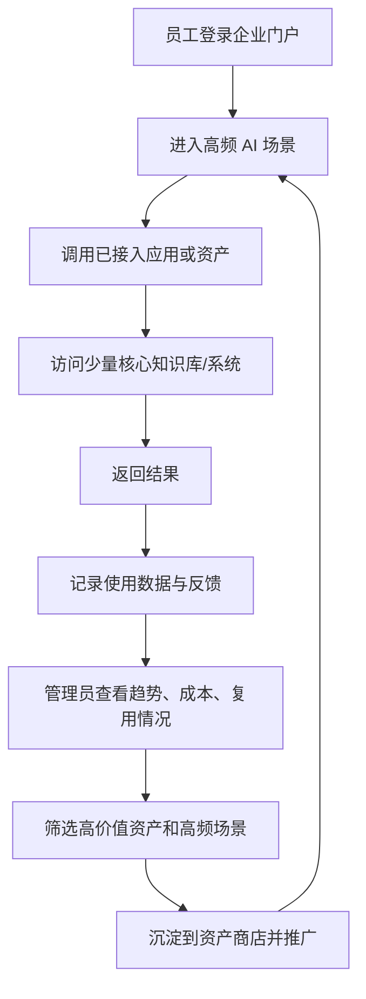
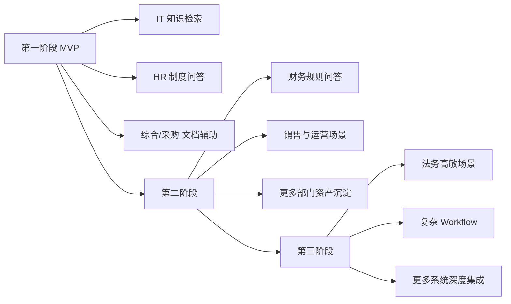

# 企业AI应用门户_MVP收敛清单与部门场景矩阵

> 文档版本：v1.0
> 创建日期：2026-03-11
> 依据：以 [企业AI门户.png](../企业AI门户.png) 的四个核心方向为基准，结合现有需求文档、实现方案、外部案例对标结果整理。

---

## 1. 文档目的

本文件用于回答三个问题：

1. 第一阶段的 MVP 到底做什么。
2. 哪些能力必须先做，哪些能力应暂缓。
3. 哪些部门和业务场景最适合作为第一批落地对象。

目标不是把平台一次做全，而是先形成“统一入口 - 使用沉淀 - 资产复用 - 治理可见”的最小闭环。

---

## 2. MVP 收敛原则

### 2.1 四条收敛原则

1. 先做高频场景，不先做低频炫技能力。
2. 先做低风险数据，不先碰高敏复杂数据。
3. 先做可复用资产，不先做一次性项目型能力。
4. 先做闭环治理，不先做大而全生态。

### 2.2 评估维度

每个候选场景用五个维度评估：

- 业务价值：是否能明显节省时间、提高效率、降低重复劳动。
- 使用频率：是否是大量员工或部门的高频任务。
- 复用潜力：是否能沉淀为 Prompt、Skill、Agent、Workflow 资产。
- 数据风险：是否涉及高敏感、强合规、强审批数据。
- 实施复杂度：是否依赖多个系统打通、复杂流程或高精度模型能力。

### 2.3 MVP 目标定义

MVP 不是“做出一个 AI 平台原型”，而是：

- 让员工能够通过统一入口访问一批高价值 AI 能力。
- 让企业开始沉淀第一批可复用资产。
- 让管理层可以看到使用趋势、成本和资产复用情况。
- 让权限、审批和审计机制从第一期就建立起来。

---

## 3. MVP 范围收敛清单

### 3.1 P0：MVP 必做范围

#### A. 统一门户能力

- 企业 SSO 登录
- 门户首页
- 场景化推荐入口
- AI 应用目录
- 全局搜索
- 个人最近使用/收藏

#### B. 资产沉淀能力

- Prompt / Skill / Agent 三类基础资产模型
- 资产发布与审核
- 资产详情页
- 标签、分类、搜索、收藏
- 基础版本管理

#### C. 治理与安全能力

- 角色权限控制
- 部门隔离
- 资产可见性控制
- 审批流
- 审计日志
- Token 消耗统计
- 应用使用趋势看板
- 资产复用率统计

#### D. 集成接入能力

- 接入 2 到 3 个核心系统或知识源
- 支持外链接入 + 统一跳转
- 支持基础 API 代理接入
- 支持统一模型调用出口

#### E. 首批可上线场景

- 企业制度与知识问答
- 文档摘要与提炼
- 会议纪要生成
- 报告初稿生成
- IT 知识检索与工单辅助
- HR 制度问答

### 3.2 P1：MVP 后紧接着做的范围

- Workflow 资产类型
- 场景模板中心
- 部门维度看板
- 评分与评论
- 通知中心
- H5 移动端适配
- 简单参数化配置发布

### 3.3 P2：建议暂缓范围

- 完整低代码/无代码复杂编排平台
- 多 Agent 自主协同引擎
- 大规模开放 API 生态
- 全量移动端深度交互
- 高复杂度跨系统自动执行闭环
- 对高敏感业务的全面开放使用

---

## 4. 部门场景矩阵

| 部门 | 典型场景 | 业务价值 | 频率 | 数据敏感度 | 复用潜力 | 实施复杂度 | 建议阶段 |
|------|----------|----------|------|------------|----------|------------|----------|
| 人力资源 | 制度问答、JD 生成、面试纪要 | 高 | 高 | 中 | 高 | 低 | MVP |
| 信息技术 | 知识检索、故障协查、工单摘要 | 高 | 高 | 中 | 高 | 中 | MVP |
| 综合/行政 | 会议纪要、通知草拟、制度查询 | 高 | 高 | 低 | 高 | 低 | MVP |
| 财务 | 报销规则问答、报表说明、采购分析 | 高 | 中 | 高 | 中 | 中 | MVP后半段 |
| 采购 | 需求整理、供应商比对、询价总结 | 高 | 中 | 中 | 高 | 中 | MVP后半段 |
| 销售 | 拜访纪要、方案润色、资料检索 | 中 | 高 | 中 | 中 | 低 | 第二阶段 |
| 法务 | 合同摘要、条款检索、风险提示 | 高 | 中 | 高 | 中 | 高 | 第二阶段 |
| 运营 | 日报周报生成、问题汇总、流程问答 | 中 | 高 | 中 | 高 | 中 | 第二阶段 |
| 市场 | 活动方案初稿、传播文案、竞品摘要 | 中 | 中 | 低 | 中 | 低 | 第二阶段 |
| 研发/产品 | 需求摘要、方案梳理、文档检索 | 中 | 中 | 中 | 高 | 中 | 第二阶段 |

---

## 5. 推荐首批试点部门

### 5.1 试点部门建议

建议优先选择以下三类：

1. 信息技术部
2. 人力资源部
3. 综合/行政 或 采购

### 5.2 推荐理由

#### 信息技术部

- 当前就是项目发起部门，推动成本最低。
- 知识密集，检索和工单辅助类场景适合快速出效果。
- 有利于平台团队先打磨接入标准和权限模型。

#### 人力资源部

- 制度问答、JD 生成、面试纪要都属于高频标准化场景。
- 数据有一定敏感度，但边界相对可控。
- 容易沉淀为可复用 Prompt 和 Agent。

#### 综合/行政 或 采购

- 文档处理、总结归纳、材料整合等场景与平台通用能力高度匹配。
- 业务价值直观，容易向管理层展示提效成果。
- 可以较快形成跨部门推广样板。

---

## 6. 场景优先级矩阵

### 6.1 适合 MVP 先上的场景

| 场景 | 原因 |
|------|------|
| 制度问答 | 高频、标准化、价值直观 |
| 文档摘要 | 通用性强、几乎所有部门都能用 |
| 会议纪要 | 易展示、易感知、ROI 明显 |
| 工单摘要/知识检索 | IT 试点价值高，能带出知识库接入能力 |
| 报告初稿生成 | 管理层容易理解“节省时间”的价值 |

### 6.2 不建议第一期重点推进的场景

| 场景 | 暂缓原因 |
|------|----------|
| 合同自动审查结论 | 风险高，容错要求高 |
| 财务自动决策建议 | 敏感度高，治理要求高 |
| 全自动跨系统执行流程 | 集成复杂度高 |
| 完整智能体自治协作 | 难以快速证明业务价值 |

---

## 7. MVP 目标闭环图

### 图示说明

第一期最重要的是让员工先“用起来”，让平台侧先“看得见”，让优秀做法先“沉下来”。这就是 MVP 成功与否的核心判断标准。

---

## 8. 分阶段部门推进建议

---

## 9. MVP 成功判定指标

### 9.1 平台使用指标

- 首批试点部门覆盖率
- 周活/月活用户数
- 人均使用次数
- 搜索成功率

### 9.2 资产沉淀指标

- 上架资产数量
- 资产复用率
- 高评分资产占比
- 部门共享资产占比

### 9.3 治理指标

- Token 成本趋势
- 审批通过率与时效
- 审计覆盖率
- 异常使用告警数

### 9.4 业务价值指标

- 文档处理时间缩短比例
- 问答响应效率提升
- 重复劳动减少反馈
- 重点场景满意度

---

## 10. 最终建议

MVP 的关键不是把平台做大，而是把“少量高频场景 + 基础资产商店 + 基础治理控制台”做扎实。只要第一批部门跑出闭环，后续扩展到财务、法务、销售等场景才会更稳。

建议后续所有正式文档和汇报材料都以本文件作为范围控制依据，避免项目重新回到“大而全”的功能堆叠路径。

