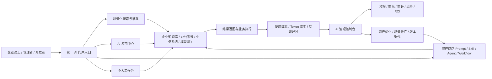
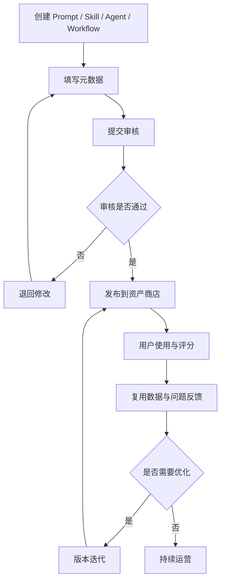
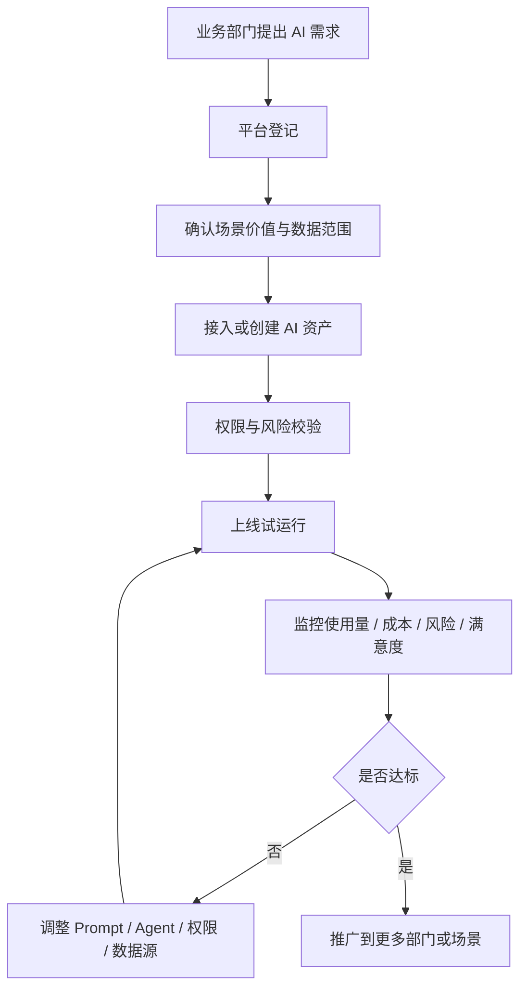

# 企业AI应用门户_业务场景版PRD_草案

> 版本：v0.1
> 日期：2026-03-11
> 说明：本草案以 [企业AI门户.png](../企业AI门户.png) 为基准，结合现有需求文档、实现方案和外部案例对标结果整理，重点从“业务场景 + 平台能力 + 治理机制”三个层面重构需求表达。

---

## 1. 项目定位

企业 AI 应用门户不是单纯的 AI 工具导航页，而是企业内部统一的 AI 能力入口、资产沉淀平台和治理中台。

其核心价值仍然保持与原型图一致：

1. 消除 AI 工具孤岛
2. 沉淀企业数字资产
3. 提升管理透明度
4. 实现业务赋能

---

## 2. 项目要解决的真实问题

### 2.1 当前主要问题

#### 问题一：AI 工具分散，员工找不到、用不顺、切换成本高

现状表现：

- 多个 AI 工具入口分散在不同系统或网址中。
- 员工不知道哪个工具适合哪个任务。
- 同一任务在多个工具间反复切换。

#### 问题二：优秀 Prompt、Skill、Agent 只停留在个人层面

现状表现：

- 好用的提示词和方法散落在聊天记录、个人文档、微信群中。
- 不同部门重复造轮子。
- 缺少标准化、版本化、可审核的资产沉淀机制。

#### 问题三：管理层看不到真实使用情况和价值产出

现状表现：

- 只能零散知道“有人在用 AI”。
- 无法清楚掌握高价值场景、成本分布、部门覆盖、投入产出。
- 缺少预算管理和治理依据。

#### 问题四：业务人员想用 AI，但不会构建和配置

现状表现：

- 业务侧有大量重复工作、知识密集工作和流程协同工作。
- 但业务人员缺少低门槛的模板、Agent 和工作流入口。
- AI 价值只能依赖少量技术人员推动，难以规模化。

---

## 3. 核心目标

### 3.1 业务目标

1. 让员工通过一个入口找到合适的 AI 能力并完成工作。
2. 让企业把优秀做法沉淀为可复用的标准资产。
3. 让管理层清楚掌握 AI 使用、成本、风险和价值。
4. 让业务部门能在受控前提下快速复制高价值 AI 场景。

### 3.2 平台目标

1. 建立统一入口与统一搜索。
2. 建立 Prompt / Skill / Agent / Workflow 的资产体系。
3. 建立权限、审批、审计、成本、效果评估的治理体系。
4. 打通核心知识库、办公系统、业务系统和模型能力。

---

## 4. 目标用户与价值

| 角色 | 核心诉求 | 平台价值 |
|------|----------|----------|
| 普通员工 | 快速找到可用 AI 工具和模板 | 减少查找成本，提升日常效率 |
| 业务专家 | 把经验沉淀为可复用资产 | 让方法被放大，扩大影响力 |
| 部门管理员 | 管理本部门应用、权限和推广情况 | 支撑部门场景落地 |
| IT / 平台团队 | 统一接入、治理和运维 | 降低平台复杂度和安全风险 |
| 管理层 | 看清使用、成本、风险和价值 | 支持预算、推广和决策 |

---

## 5. 核心业务场景

### 5.1 通用高频场景

1. 制度与知识问答
2. 文档摘要与提炼
3. 会议纪要生成
4. 报告初稿生成
5. 翻译与润色
6. 数据分析辅助说明

### 5.2 部门化场景示例

| 部门 | 典型场景 | 推荐资产形态 |
|------|----------|--------------|
| 人力 | 制度问答、JD 生成、面试纪要 | Prompt / Agent |
| 财务 | 采购分析、报销规则问答、报表说明 | Skill / Agent |
| 法务 | 合同条款检索、风险提示、审阅摘要 | Agent / Workflow |
| IT | 知识检索、故障协查、工单摘要 | Agent / Workflow |
| 销售 | 客户拜访纪要、方案润色、资料检索 | Prompt / Skill |
| 采购 | 供应商对比、采购需求整理、询价材料总结 | Prompt / Workflow |

---

## 6. 目标形态

### 6.1 企业 AI 门户目标形态图

### 6.2 目标形态解释

平台前台面向员工提供统一入口、搜索、应用和资产；平台后台面向管理员提供治理控制台。前台解决“找得到、用得上、能复用”，后台解决“看得清、管得住、能推广”。

---

## 7. 平台能力设计

### 7.1 统一 AI 应用门户

目标：打造单一入口，按场景、角色、部门推荐 AI 能力。

关键能力：

- 企业统一登录与 SSO
- 场景化首页
- 应用目录
- 全局搜索
- 个人工作台
- 收藏与最近使用

### 7.2 应用商店化资产管理

目标：将 Prompt、Skill、Agent、Workflow 沉淀为企业资产。

关键能力：

- 资产分类与标签
- 资产发布与审核
- 版本管理与回滚
- 收藏、评分、评论
- 适用部门、场景、数据等级、维护人等元数据
- 可见性控制：私有 / 部门 / 全公司

### 7.3 AI 治理控制台

目标：让平台具备可治理、可追踪、可审计、可衡量的企业能力。

关键能力：

- 使用趋势看板
- Token 成本与预算管理
- 资产复用率
- 重点场景覆盖率
- 审批流与审计日志
- 风险与异常告警
- ROI 和业务价值分析

### 7.4 企业级权限控制

目标：保证在共享和复用的同时，满足企业安全与隔离要求。

关键能力：

- 统一身份认证
- 角色权限控制
- 组织层级控制
- 数据范围控制
- 资源归属控制
- API 密钥与敏感信息保护

### 7.5 应用接入与集成层

目标：让门户真正接入企业现有环境，而不是只聚合链接。

关键能力：

- 应用接入标准：外链、嵌入、代理调用、统一网关调用
- 企业知识库接入
- 办公系统接入
- 核心业务系统接入
- 模型网关接入

---

## 8. 企业治理机制

### 8.1 资产生命周期治理

### 8.2 AI 治理控制逻辑

---

## 9. MVP 范围建议

### 9.1 MVP 原则

1. 优先高频、低风险、易复用场景
2. 优先打通少量核心系统，避免过早扩展
3. 优先形成“使用 - 沉淀 - 复用 - 治理”的闭环
4. 优先验证真实业务价值，而不是堆功能

### 9.2 MVP 必做范围

1. SSO 登录与统一门户首页
2. 应用目录与场景化搜索
3. Prompt / Skill / Agent 基础资产商店
4. 审批、权限、审计、部门隔离
5. 使用趋势、Token 成本、资产复用基础看板
6. 接入 2 到 3 个核心知识库或业务系统

### 9.3 MVP 暂缓范围

1. 复杂多 Agent 编排平台
2. 过多的社区化互动能力
3. 全面开放 API 生态
4. 大规模移动端深度能力

---

## 10. 汇报表达建议

### 10.1 向领导汇报时的主线

1. 先讲问题：AI 工具分散、资产流失、管理不透明、业务门槛高。
2. 再讲目标：统一入口、沉淀资产、治理透明、业务赋能。
3. 再讲路径：先做 MVP 高频场景，再滚动沉淀为平台资产。
4. 最后讲风险控制：统一鉴权、审批审计、成本与 ROI 可视化。

### 10.2 建议搭配展示材料

- 原型图：说明项目发起初衷
- 参考案例流程图：说明外部成熟路径
- 本文档中的目标形态图和治理流程图：说明我们自己的逻辑闭环

---

## 11. 与原有文档关系

本草案不是替代原文，而是对以下两份文档的上层重构：

- [`企业AI应用门户_需求文档.md`](../企业AI应用门户_需求文档.md)
- [`企业AI应用门户_实现方案.md`](../企业AI应用门户_实现方案.md)

建议后续处理方式：

1. 先按本草案重写正式 PRD。
2. 再基于正式 PRD 回改实现方案。
3. 最后输出汇报版 PPT 提纲或领导汇报稿。
