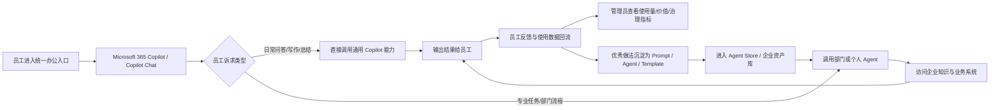
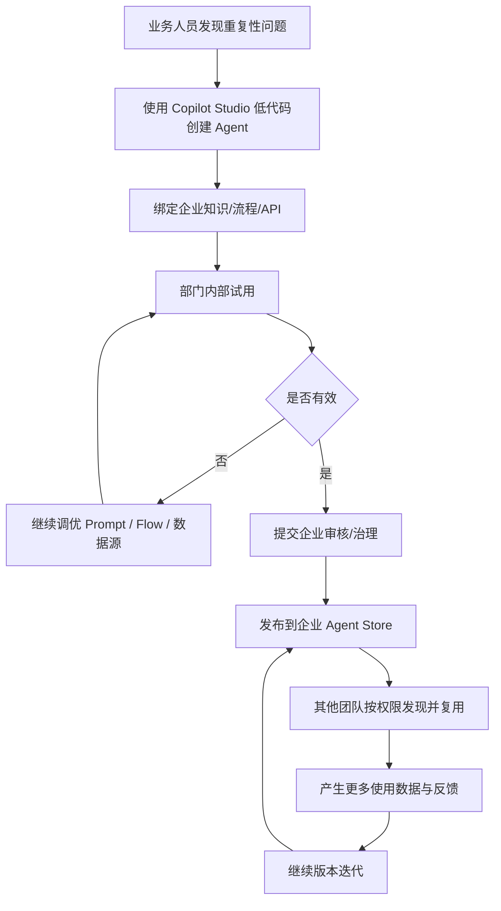
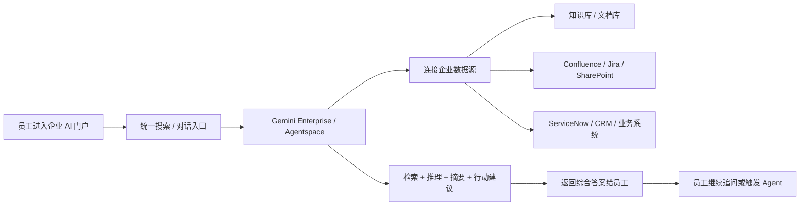
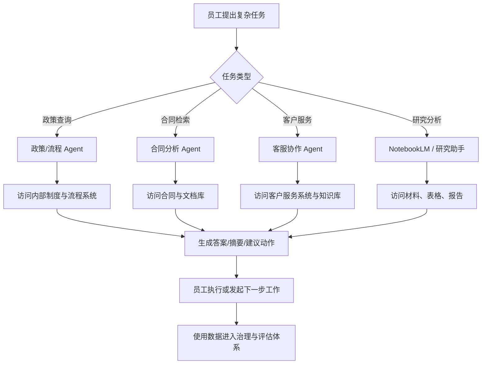
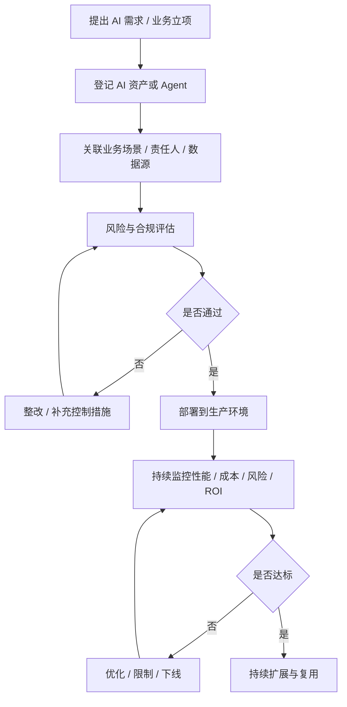
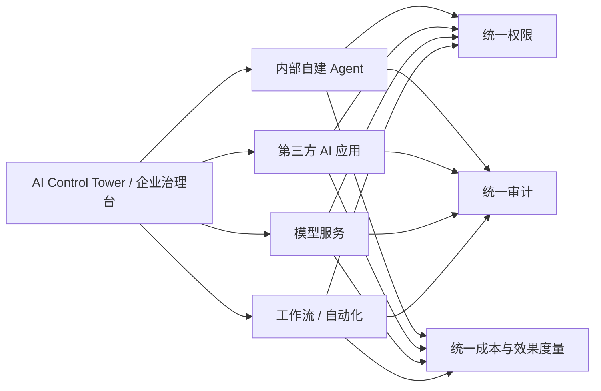
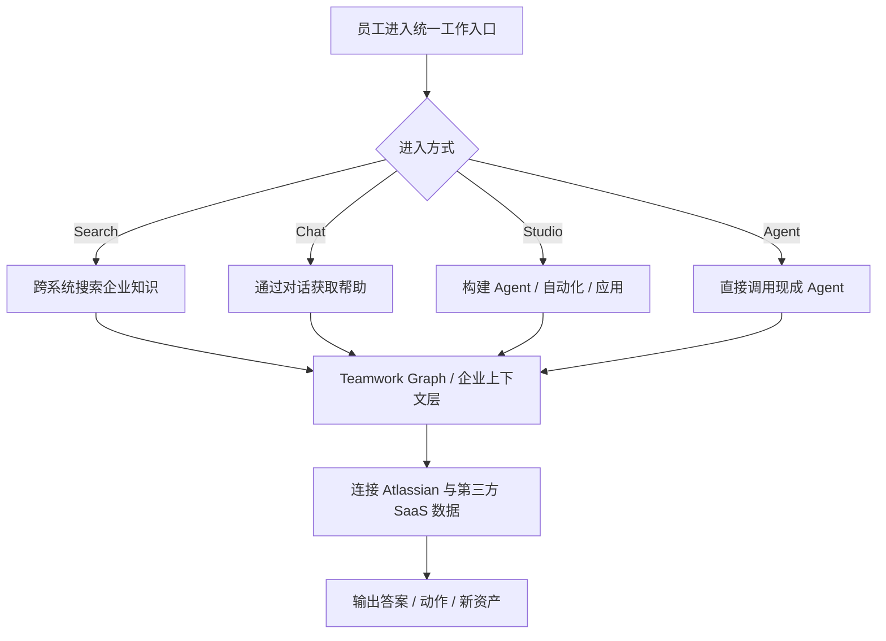
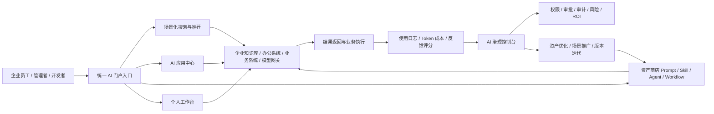
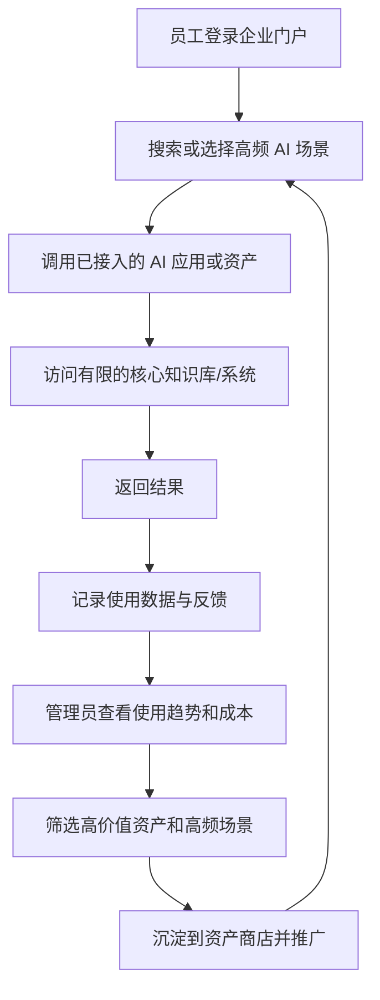

# 企业AI应用门户参考案例流程图

> 说明：以下流程图基于公开官方资料进行业务逻辑抽象，适合用于方案梳理和领导汇报展示。
> 这些图不是对外部企业内部真实系统架构的逐项还原，而是为了提炼其“企业级 AI 门户”运行逻辑。
> 调研时间：2026-03-11

---

## 1. 参考企业 A：EY + Microsoft 365 Copilot

### 公开信息摘要

根据 Microsoft 官方客户案例，EY 已向超过 150,000 名员工部署 Microsoft 365 Copilot，并通过 Copilot Studio 支持员工构建自己的 agents。官方案例还提到，EY 的财务团队已构建采购订单分析 agent 来优化跨系统协作流程。

来源：

- https://www.microsoft.com/en/customers/story/25662-ey-microsoft-365-copilot
- https://learn.microsoft.com/en-us/copilot/agents
- https://www.microsoft.com/en-us/microsoft-copilot/blog/copilot-studio/whats-new-in-copilot-studio-may-2025/

### 流程图 A1：员工使用与能力沉淀闭环

### 这张图怎么讲

这类企业不是把 AI 当成单点工具，而是让员工从统一入口进入，先使用通用能力，再逐步转向部门 Agent。使用过程中产生的数据和优秀做法会持续沉淀成企业资产，形成“使用 - 沉淀 - 复用”的闭环。

### 流程图 A2：业务人员自建 Agent 并进入企业复用体系

### 这张图怎么讲

这张图强调一个关键点：企业真正要的是“业务专家把经验做成资产”，而不是永远依赖 IT 开发。对你这个项目来说，这正对应原型图里的“数字资产沉淀”和“业务赋能”。

---

## 2. 参考企业 B：Wells Fargo / Google Gemini Enterprise（原 Agentspace 能力）

### 公开信息摘要

Google 官方博客披露，Wells Fargo 作为 Google Agentspace 的早期采用者，正在让员工通过统一、安全的平台使用 agent，能力包括查找和综合内部信息、自动化任务与工作流、基于 NotebookLM 做研究与分析。Google 官方产品说明同时强调，Gemini Enterprise 提供统一的企业搜索、agent 发现与管理能力，并可连接 Confluence、Jira、SharePoint、ServiceNow 等数据源。

来源：

- https://cloud.google.com/blog/topics/financial-services/wells-fargo-agentic-ai-agentspace-empowering-workers/
- https://cloud.google.com/blog/products/ai-machine-learning/bringing-ai-agents-to-enterprises-with-google-agentspace
- https://cloud.google.com/gemini-enterprise

### 流程图 B1：统一搜索入口驱动多系统知识访问

### 这张图怎么讲

这类平台的价值不在“会聊天”，而在“能跨系统找信息并合成为答案”。这对企业领导来说很好理解，因为它直接对应“减少查资料和找人的时间成本”。

### 流程图 B2：场景 Agent 执行银行/企业任务流程

### 这张图怎么讲

这张图适合说明“统一入口不等于单一能力”。入口统一了，但后面仍然是按场景分发给不同 Agent 执行。你的项目后面如果要做部门化场景入口，这张逻辑很适合作为汇报示意图。

---

## 3. 参考企业 C：ServiceNow AI Control Tower

### 公开信息摘要

ServiceNow 官方在 2025-05-06 发布 AI Control Tower，定位为统一指挥中心，用来治理、管理、保护并衡量任何 AI agent、模型和 workflow。官方产品页强调：统一可视化、风险与合规、生命周期管理、AI 投资价值追踪。

来源：

- https://www.servicenow.com/products/ai-control-tower.html
- https://newsroom.servicenow.com/press-releases/details/2025/ServiceNow-Launches-AI-Control-Tower-a-Centralized-Command-Center-to-Govern-Manage-Secure-and-Realize-Value-From-Any-AI-Agent-Model-and-Workflow/default.aspx

### 流程图 C1：AI 治理控制台全生命周期流程

### 这张图怎么讲

这张图适合拿去和领导解释：企业 AI 看板不能只看调用次数，而要覆盖“立项 - 审核 - 上线 - 监控 - 优化/下线”的全生命周期治理。这也是你项目里“全链路数据看板”最值得升级的方向。

### 流程图 C2：企业统一治理台与多类 AI 资产的关系

### 这张图怎么讲

这张图适合说明为什么企业不能只做“应用商店”。随着 AI 资产越来越多，必须有一个统一治理台把权限、审计、成本和绩效拉通。

---

## 4. 参考企业 D：Atlassian Rovo

### 公开信息摘要

Atlassian 官方将 Rovo 明确拆成 Search、Chat、Studio、Agent 四部分，并强调跨 SaaS 搜索、AI 助手、构建能力和 Agent 协作能力，同时提供数据驻留和 AI access controls 等企业控制能力。

来源：

- https://www.atlassian.com/software/rovo
- https://support.atlassian.com/rovo/docs/what-is-rovo/

### 流程图 D1：搜索、Chat、构建、Agent 一体化入口

### 这张图怎么讲

这张图最适合拿来说明“为什么门户首页不应该只是应用列表”。真正成熟的企业 AI 门户，通常会把搜索、对话、构建、Agent 入口放在同一层级，让员工按任务自然进入。

---

## 5. 对本项目的汇报版建议流程图

### 流程图 E1：企业 AI 应用门户目标形态图

### 这张图怎么讲

这张图可以直接作为你们项目的目标形态图。它保持了原型图里的四个核心点，但补上了“连接企业系统”和“治理控制台”，更接近真实企业落地逻辑。

### 流程图 E2：适合 MVP 阶段的落地闭环

### 这张图怎么讲

这张图适合对领导讲 MVP：先做少量高频场景，形成使用数据，再把高价值能力沉淀到商店，逐步滚动扩展，而不是一开始做成大而全平台。

---

## 6. 汇报时的使用建议

### 建议优先展示顺序

1. 先展示 E1：说明我们项目目标形态。
2. 再展示 A1 或 B1：说明全球企业已在这么做，而且逻辑相似。
3. 再展示 C1：说明为什么我们不能只做门户，还要做治理。
4. 最后展示 E2：说明我们准备如何分阶段落地。

### 讲解时的三句话模板

1. 外部成熟企业已经不是单做 AI 聊天工具，而是在做统一入口、资产沉淀和治理闭环。
2. 我们这次方案与国际主流方向一致，但会更聚焦企业内部场景，不盲目做大而全。
3. 我们建议先从 MVP 高频场景切入，再逐步演进到完整的企业级 AI 门户与治理平台。
