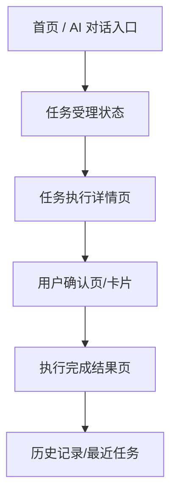
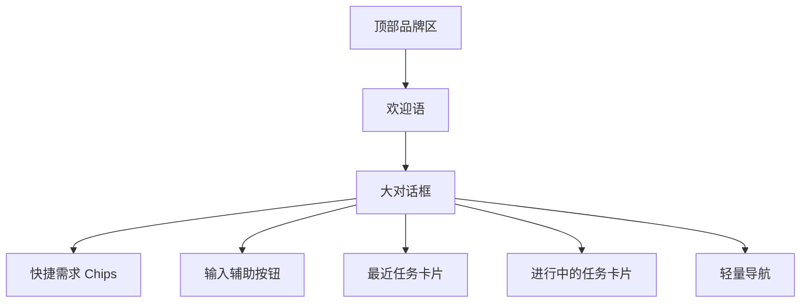
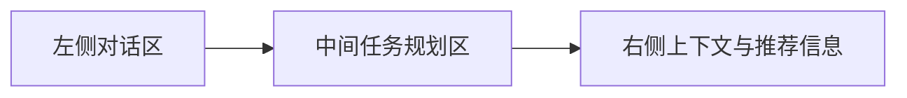
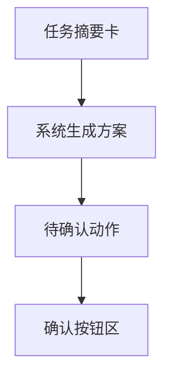
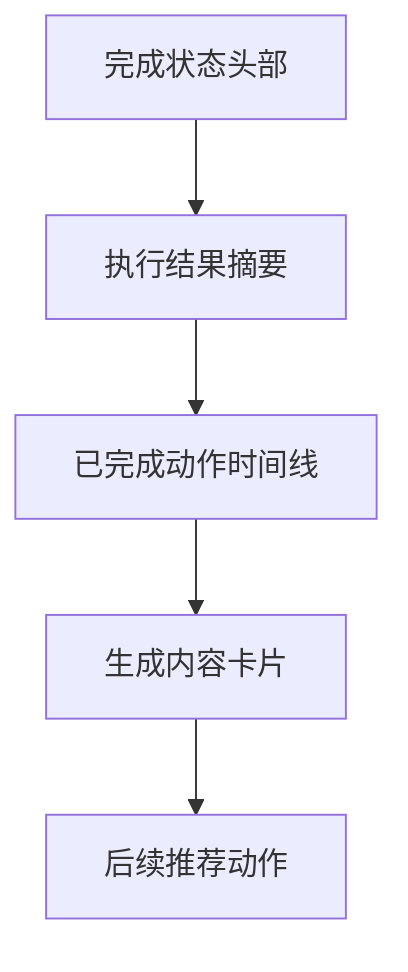
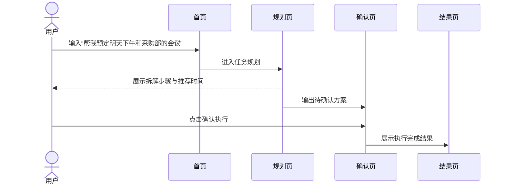

# 企业AI应用门户_DemoA+DemoC页面结构稿

> 版本：v1.0
> 日期：2026-03-11
> 说明：本稿用于指导 Demo A（AI 对话首页版）与 Demo C（企业流程助手版）的高保真界面设计和前端实现。

---

## 1. 目标

本次 demo 组合要同时验证两件事：

1. 首页是否具备足够强的 AI-native 气质。
2. 企业流程是否能通过 AI 对话真正形成闭环。

因此，页面设计必须既像 ChatGPT / Cursor 这类 AI 产品，又能明确展示“会议预定、议程生成、纪要输出”这类企业流程能力。

---

## 2. Demo 组合范围

### Demo A：AI 对话首页版

核心目标：

- 用户一进入页面，就知道这是一个 AI 工作入口。
- 首页的主视觉必须是大对话框。
- 用户不需要先找菜单，而是先输入需求。

### Demo C：企业流程助手版

核心目标：

- 用户提出“预定会议”类需求后，AI 能进入执行状态。
- 页面能清楚展示：识别意图、推荐时间、生成议程、等待确认、发送邀请、生成纪要。

---

## 3. 整体信息架构



说明：

- 首页负责发起。
- 任务详情页负责展示 AI 执行过程。
- 确认页负责体现企业流程中的人工确认。
- 结果页负责体现“AI 帮我做完了什么”。

---

## 4. 页面清单

建议本轮 demo 至少做 4 个页面状态。

### 4.1 页面一：首页 / AI 对话入口

建议文件名：`HomeChatLanding`

#### 页面目标

- 建立产品气质。
- 让用户快速发起需求。
- 展示常见企业流程入口。

#### 页面结构



#### 模块说明

1. 顶部品牌区
   - Logo
   - 产品名称，如“企业AI助手”或“企业智能工作入口”
   - 右上角用户头像

2. 欢迎语
   - 示例：`今天想完成什么工作？`
   - 副标题：`用一句话描述需求，系统将调用内部智能体协助完成。`

3. 大对话框
   - 占首页视觉核心
   - Placeholder 示例：`例如：帮我预定明天下午和采购部的项目评审会议，并生成议程。`

4. 快捷需求 Chips
   - `预定会议`
   - `写会议纪要`
   - `查制度`
   - `生成周报`
   - `发起采购`

5. 输入辅助按钮
   - 上传附件
   - 选择知识范围
   - 选择执行模式（标准 / 深度）

6. 最近任务卡片
   - 最近发起过的 3 到 4 个任务

7. 进行中的任务卡片
   - 展示正在跑的智能体任务
   - 状态：处理中 / 待确认 / 已完成

8. 轻量导航
   - 历史记录
   - 资产商店
   - 治理后台
   - 个人中心

#### 视觉要求

- 大面积留白
- 中央聚焦
- 柔和渐变背景
- 半透明卡片
- 弱边框和发光输入框
- 不使用传统后台首页宫格风格

---

### 4.2 页面二：任务受理与规划中

建议文件名：`TaskPlanningView`

#### 页面目标

让领导看到：AI 不是直接给答案，而是在理解需求、规划步骤。

#### 页面结构



#### 模块说明

1. 左侧对话区
   - 展示用户原始输入
   - 展示 AI 的阶段性回复

2. 中间任务规划区
   - 识别到的任务类型：`会议预定`
   - 子任务步骤：
     - 查询参会人时间
     - 查询会议室
     - 生成议程
     - 发送邀请
   - 当前执行步骤高亮

3. 右侧上下文信息
   - 识别到的参会对象
   - 建议时间窗口
   - 可用会议室
   - 相关历史会议

#### 页面状态文案示例

- `正在识别会议参与方...`
- `已找到 3 个可用时间段。`
- `正在根据会议主题生成议程草稿。`

---

### 4.3 页面三：待确认执行页

建议文件名：`TaskConfirmationView`

#### 页面目标

体现企业流程中的关键控制点，展示“AI 建议 + 用户确认”。

#### 页面结构



#### 模块说明

1. 任务摘要卡
   - 任务名称：`采购评审会议预定`
   - 参与人
   - 时间
   - 会议室

2. 系统生成方案
   - 推荐会议时间
   - 会议议程
   - 拟发送邀请内容

3. 待确认动作
   - 是否发送会议邀请
   - 是否同步抄送秘书/相关负责人
   - 是否创建会后纪要任务

4. 按钮区
   - `确认并执行`
   - `重新生成方案`
   - `修改后再确认`

#### 页面价值

这是整个 demo 中最像企业真实使用场景的一页，因为它体现了合规、审批和执行控制。

---

### 4.4 页面四：执行完成结果页

建议文件名：`TaskCompletedView`

#### 页面目标

体现“AI 不只是回答，而是真的替用户完成了一部分工作”。

#### 页面结构



#### 模块说明

1. 完成状态头部
   - 标题：`会议已安排完成`
   - 副标题：`邀请已发送，议程已生成，会后纪要任务已创建。`

2. 执行结果摘要
   - 时间
   - 会议室
   - 参会人
   - 邀请发送状态

3. 已完成动作时间线
   - 查询日历
   - 预定会议室
   - 生成议程
   - 发送邀请
   - 创建纪要任务

4. 生成内容卡片
   - 会议议程
   - 邀请文案
   - 纪要模板

5. 后续推荐动作
   - `继续补充会前材料`
   - `生成主持词`
   - `会后自动生成纪要`

---

## 5. 页面间跳转逻辑



---

## 6. 推荐组件清单

### 6.1 首页组件

- `HeroBrand`
- `ChatInputPanel`
- `QuickActionChips`
- `RecentTaskList`
- `OngoingTaskCard`
- `LightNavSidebar`

### 6.2 任务组件

- `ConversationPanel`
- `TaskPlanTimeline`
- `TaskContextCard`
- `SuggestedActionCard`
- `ConfirmationActionBar`
- `ExecutionResultTimeline`

### 6.3 通用组件

- `StatusBadge`
- `GlowingPanel`
- `GradientButton`
- `SectionTitle`
- `AgentStepCard`

---

## 7. 假数据建议

### 首页快捷需求

```json
[
  "预定会议",
  "写会议纪要",
  "查制度",
  "生成周报",
  "发起采购"
]
```

### 最近任务

```json
[
  {
    "title": "采购评审会议预定",
    "status": "已完成"
  },
  {
    "title": "年度制度摘要整理",
    "status": "已完成"
  },
  {
    "title": "项目周报生成",
    "status": "进行中"
  }
]
```

### 会议推荐方案

```json
{
  "meetingTitle": "采购评审会",
  "time": "2026-03-12 14:00-15:00",
  "room": "A3-08会议室",
  "participants": ["采购部", "项目经理", "技术负责人"],
  "agenda": [
    "项目背景同步",
    "采购需求评审",
    "风险点确认",
    "后续行动安排"
  ]
}
```

---

## 8. 前端实现建议

### 8.1 第一阶段

- 只做前端静态高保真页面
- 用本地 mock 数据
- 强调视觉和关键状态

### 8.2 第二阶段

- 接入简单状态机
- 模拟任务从“规划中”到“待确认”再到“已完成”
- 页面间可真实跳转

### 8.3 第三阶段

- 再考虑接入真实或半真实的会议数据接口
- 验证企业流程演示可用性

---

## 9. 最小开发清单

如果要最快做出第一版，建议至少完成：

1. 首页
2. 任务规划页
3. 确认页
4. 完成页
5. 统一主题样式
6. 一套会议预定 mock 数据

这样就已经足够支撑一次完整汇报演示。

---

## 10. 最终建议

当前最合理的 demo 起手方式不是直接做完整系统，而是先把“首页气质 + 会议预定闭环”打磨好。

也就是说：

- 首页负责让领导相信方向是对的。
- 流程闭环负责让领导相信这个系统真的有价值。

这两部分只要做扎实，后续再扩展到更多流程和更多智能体能力就顺了。
