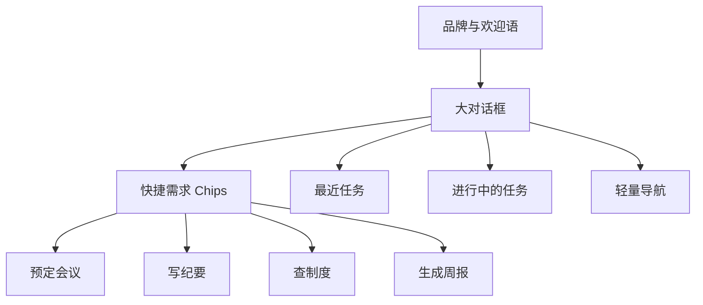
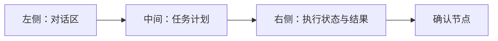
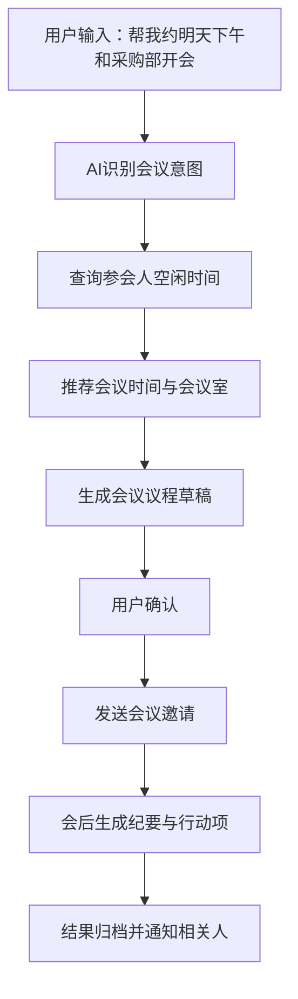

# 企业AI应用门户_Demo方案

> 版本：v1.0
> 日期：2026-03-11
> 说明：本文件用于规划下一步可视化 demo，目标是通过不同版本的首页与交互方案，验证领导最新提出的 V2 扩充方向。

---

## 1. Demo 目标

本轮 demo 不只是做页面展示，而是要回答三个核心问题：

1. 首页如何体现“AI 原生入口”而不是传统门户。
2. 用户输入需求后，系统如何体现“智能体正在处理任务”。
3. 企业流程如何通过 AI 对话完成，而不是退回传统表单系统。

因此，demo 应同时覆盖：

- 首页气质
- 对话交互
- 任务执行状态
- 企业流程场景

---

## 2. Demo 总体建议

建议不要只做一个版本，而是并行做 3 个版本，每个版本强调不同重点。

### Demo A

**定位：AI 对话首页版**

重点：先把首页气质和入口逻辑定下来。

### Demo B

**定位：智能体执行工作台版**

重点：让领导看到“不是只聊天，而是真的在处理任务”。

### Demo C

**定位：企业流程助手版**

重点：把会议预定、会前准备、会后纪要这类企业流程闭环演示出来。

---

## 3. Demo A：AI 对话首页版

### 3.1 目标

展示一个类似 ChatGPT / Cursor 风格的首页，让用户一进来就感觉这是一个 AI 产品，而不是传统企业系统。

### 3.2 页面结构

### 3.3 核心模块

- 顶部品牌区
- 中央大对话框
- 快捷需求卡片
- 最近任务列表
- 进行中任务卡片
- 轻量侧边历史记录

### 3.4 视觉风格建议

- 深浅渐变背景或带轻微纹理的科技背景
- 大留白
- 低对比边框
- 柔和高光和微发光
- 少表格式布局
- 芯片式快捷任务入口

### 3.5 最适合演示的内容

- 用户输入一句自然语言需求
- 首页立即进入任务受理状态
- 展示 AI 正在理解和分发任务

### 3.6 适合回答的问题

- 首页是否足够像 AI 产品
- 是否摆脱传统制造企业系统风格
- 用户第一感知是否足够简单直接

---

## 4. Demo B：智能体执行工作台版

### 4.1 目标

展示“用户一句话提出需求后，系统并不是简单回答，而是由内部智能体拆解并执行任务”。

### 4.2 页面结构

### 4.3 核心模块

#### 左侧

- 用户对话区
- 需求输入框
- 历史对话

#### 中间

- 任务拆解步骤
- 智能体选择结果
- 调用工具列表
- 当前执行步骤高亮

#### 右侧

- 正在访问的系统或工具
- 执行日志摘要
- 需要用户确认的动作
- 最终执行结果回执

### 4.4 建议演示场景

- “帮我预定明天下午和采购部的会议，并生成议程”
- “帮我总结这个制度，并给出执行步骤”
- “帮我生成本周项目周报初稿”

### 4.5 适合回答的问题

- 什么叫“类似 OpenClaw 的处理方式”
- 智能体如何不是只给答案，而是真的执行
- 企业系统与 AI 如何连接起来

### 4.6 关键交互亮点

- 显示“AI 正在规划任务”
- 显示“已调用会议系统 / 知识库 / 邮件工具”
- 显示“请确认是否发送会议邀请”
- 显示“执行完成，已生成议程和邀请函”

---

## 5. Demo C：企业流程助手版

### 5.1 目标

让领导看到最贴近企业内部价值的场景闭环，即“通过 AI 对话完成一个真实流程”。

### 5.2 建议选题

最建议优先演示：

1. 预定会议
2. 会前议程生成
3. 会后纪要与行动项输出

这是一个从前到后完整且容易理解的场景。

### 5.3 场景流程图

### 5.4 页面结构

- 上方：对话与任务描述
- 中间：流程时间线
- 下方：确认按钮与结果卡片
- 右侧：参与人、时间、会议室、议程草稿

### 5.5 适合回答的问题

- 企业流程到底如何 AI 化
- 系统如何与会议、邮件、通知、纪要等工具协作
- 这套能力对管理层和员工的直接价值是什么

---

## 6. 三个 Demo 的区别

| Demo | 核心问题 | 重点展示 | 适合对象 |
|------|----------|----------|----------|
| Demo A | 首页长什么样 | AI 风格首页与大对话框入口 | 领导、产品 |
| Demo B | AI 如何执行任务 | 智能体规划、路由、执行状态 | 领导、产品、技术 |
| Demo C | 企业流程如何落地 | 会议预定等完整流程闭环 | 领导、业务、产品 |

---

## 7. 推荐执行顺序

### 第一优先级：Demo A

原因：

- 首页是领导最先感知的部分。
- 能最快对“气质”和“方向”形成共识。
- 成本最低，反馈最快。

### 第二优先级：Demo C

原因：

- 企业流程价值最容易讲清楚。
- 会议预定场景天然适合做 AI 化展示。
- 对管理层最直观。

### 第三优先级：Demo B

原因：

- 最能体现技术深度。
- 适合在首页和场景方向确认后，再展示系统的“执行能力”。

如果资源允许，也可以把 B 和 C 合并成一个“执行型流程助手 demo”。

---

## 8. 视觉方向建议

### 8.1 统一风格关键词

- 智能
- 克制
- 可信
- 现代
- 轻盈
- 任务导向

### 8.2 推荐视觉元素

- 渐变色背景
- 柔和阴影
- 芯片化快捷入口
- 卡片式状态块
- 任务时间线
- 微光感输入框
- 轻量动画和状态切换

### 8.3 不建议的视觉方向

- 传统 ERP / MES / OA 后台样式
- 满屏菜单树
- 大量表格直接铺首页
- 高密度说明文字
- 典型制造企业系统式蓝灰重布局

---

## 9. Demo 开发建议

### 9.1 第一阶段：高保真静态交互 Demo

目标：快速确认方向。

建议方式：

- 先做纯前端高保真界面
- 使用假数据和假任务流
- 模拟任务处理中、待确认、已完成状态

### 9.2 第二阶段：半联动 Demo

目标：验证执行链路。

建议方式：

- 接入模拟 Agent 路由
- 接入假会议系统数据
- 接入简单的任务状态机

### 9.3 第三阶段：可演示 PoC

目标：展示真实能力。

建议方式：

- 打通一个真实日历/会议接口或模拟服务
- 支持真实“生成议程”“发送邀请”“输出纪要”链路
- 保留审计和确认节点

---

## 10. 最终建议

如果下一步只能做一件事，我建议先做：

**Demo A + Demo C 组合版。**

原因是：

- Demo A 解决首页气质和入口方式。
- Demo C 解决企业流程 AI 化的业务价值。
- 两者组合最能帮助领导快速判断方向是否正确。

如果之后再深入，再补 Demo B，把智能体执行链路拆解得更技术化、更完整。
