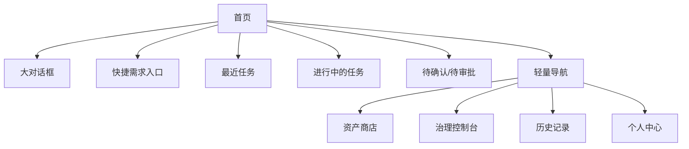
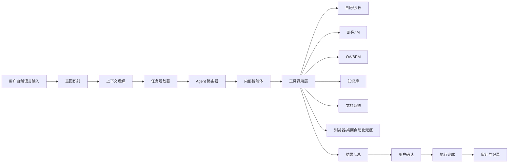

# 企业AI应用门户_V2扩充说明

> 版本：v1.0
> 日期：2026-03-11
> 说明：本文件不是替代现有 PRD 和架构方案，而是在现有“门户 + 资产 + 治理”主线基础上的 V2 能力扩充说明。

---

## 1. 扩充背景

基于最新会议结论，当前项目需要在原有企业 AI 门户能力之上，新增一层更靠前的 AI 对话式入口，以及一层更靠后的智能体执行与流程能力。

这不是方向转移，而是产品升级：

- 原有统一门户能力继续保留。
- 原有资产商店、治理控制台继续保留。
- 只是首页第一入口从“应用/菜单入口”升级为“先说需求”。
- 需求提交后，不只是返回答案，而是进入内部智能体执行链路。

一句话定义：

**V1 是企业 AI 门户，V2 是企业 AI 门户 + 对话式统一入口 + 智能体执行层。**

---

## 2. V2 增加了什么

### 2.1 新增能力一：对话式统一入口

用户进入系统后，首先看到一个大的对话框。

这个对话框不是普通搜索框，而是整个系统的主入口，用户可以直接输入：

- 帮我预定明天下午和采购部的会议
- 帮我总结这份制度并输出要点
- 帮我查询这个报销规则
- 帮我生成一份项目周报
- 帮我发起采购申请

也就是说，用户不再需要先理解系统菜单、模块分类和应用名称，而是先表达需求。

### 2.2 新增能力二：智能体执行层

用户输入需求后，系统不只是生成回答，而是要进入任务执行模式：

- 识别意图
- 理解上下文
- 拆解任务
- 路由到合适的内部智能体
- 调用企业系统和工具
- 在关键节点请求用户确认
- 执行完成并返回结果

### 2.3 新增能力三：AI 驱动的企业流程助手

企业内大量流程不应停留在传统表单驱动模式，而应增加 AI 驱动的自然语言入口。

典型场景包括：

- 预定会议
- 创建议程
- 会后纪要与行动项分发
- 发起采购流程
- 提交请假/审批类请求
- 生成制度摘要或通知初稿

这些流程不一定完全替代原有系统，但入口应改为 AI，对底层仍然可以调用 OA、BPM、会议系统、邮件、日历等现有能力。

---

## 3. V2 与 V1 的关系

### 3.1 不变的部分

以下能力仍然保留，而且仍然重要：

- 统一登录
- 资产商店
- Prompt / Skill / Agent 资产沉淀
- 权限控制
- 审批流
- 审计日志
- Token 成本与治理控制台

### 3.2 变化的部分

变化不在“有没有这些能力”，而在“用户如何先接触到它们”。

#### V1 入口逻辑

- 用户先看到门户首页
- 再找应用或资产
- 再进入使用

#### V2 入口逻辑

- 用户先看到对话框
- 先说出需求
- 再由系统决定调用什么资产、智能体、工具和流程

因此，应用中心和资产商店不消失，而是从首页主舞台退到后台支撑层和二级入口层。

---

## 4. V2 信息架构建议

### 解释

首页应该围绕“我要完成什么工作”来组织，而不是围绕“系统有什么模块”来组织。

---

## 5. V2 首页设计建议

### 5.1 首页核心结构

1. 品牌区：体现企业 AI 品牌和可信感。
2. 大对话框：绝对主视觉。
3. 快捷需求 Chips：如“预定会议”“写会议纪要”“查制度”“生成周报”。
4. 最近任务区：展示最近发起过的事项。
5. 进行中任务区：展示智能体正在处理的工作。
6. 待我确认区：展示需要用户确认的执行动作。
7. 轻量导航区：资产商店、治理、历史记录等退到辅助层。

### 5.2 风格方向

关键词建议：

- AI-native
- 对话优先
- 极简
- 高留白
- 柔和发光
- 科技感但不过度赛博
- 企业可信而不是后台生硬

不建议再沿用：

- 大面积传统蓝灰后台色
- 强菜单式门户首页
- 密集表格和模块堆叠
- 传统制造企业系统的重边框感

---

## 6. V2 处理链路建议

### 关键原则

1. API 调用优先。
2. 浏览器或桌面自动化只作为兜底方案。
3. 所有执行型动作必须有日志和审计。
4. 关键动作必须有用户确认节点。

---

## 7. 对现有文档的影响

### 7.1 业务场景版 PRD

需要补充：

- 首页从“门户首页”升级为“对话式工作入口”。
- 新增“需求理解与任务执行”章节。
- 新增“AI 驱动的企业流程助手”章节。
- 应用商店不再作为首页主入口，而是作为后台支撑层。

### 7.2 企业落地架构方案

需要补充：

- Planner / Agent Router / Tool Layer / Confirmation Layer。
- 执行轨迹、回放、审计和沙箱能力。
- 面向日历、邮件、OA、BPM、会议室、通讯录等连接器设计。

### 7.3 综合阅读版

需要补充：

- 当前项目的最新一句话定位。
- 为什么首页要改成大对话框。
- 为什么企业流程要以 AI 对话作为入口。

---

## 8. V2 最适合先落地的企业流程场景

建议优先做三个最容易展示价值的流程：

1. 预定会议
2. 会议纪要与行动项生成
3. 制度问答与任务指引

原因：

- 它们的管理层理解成本低。
- 使用路径清晰。
- 容易做成可演示 demo。
- 能自然体现“对话入口 + 智能体执行 + 企业系统调用”。

---

## 9. V2 对 demo 的要求

如果后续做 demo，至少应体现三件事：

1. 首页是一个 AI 产品，而不是传统系统首页。
2. AI 不只是回答问题，而是真的能进入执行状态。
3. 企业流程不是表单堆砌，而是自然语言驱动、关键节点确认、后台系统完成落地。

---

## 10. 最终结论

V2 不是对 V1 的否定，而是让原有门户真正长出“AI 原生入口”和“智能体执行能力”。

也就是说：

- V1 解决的是“能力收口、资产沉淀、治理可见”。
- V2 解决的是“用户如何以最自然的方式发起需求，并由系统完成执行”。

两者应该叠加，而不是替换。
