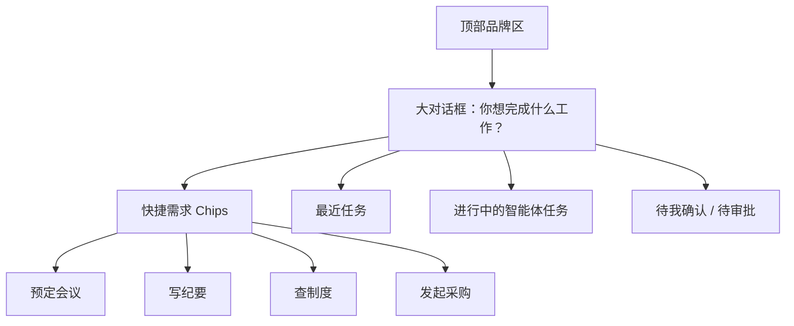
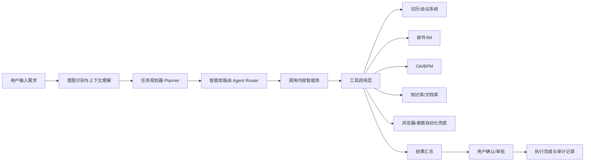

# 企业AI应用门户_V2方向调整与Demo建议

> 版本：v1.0
> 日期：2026-03-11
> 背景：基于与领导最新会议结论，对现有“企业AI应用门户”相关文档进行二次方向校准。

---

## 1. 会议结论摘要

本次会议带来的核心变化，不是界面细节优化，而是产品定位发生明显转向：

1. 用户进入系统后，首先应该看到一个大的对话框，而不是应用列表。
2. 页面整体风格必须更 AI-native，摆脱传统制造企业系统的强后台感。
3. 用户需求在对话后，不只是“返回答案”，而是要进入类似 OpenClaw / Agentic System 的处理模式，由内部智能体进行理解、拆解、执行。
4. 企业内常见流程，例如预定会议，也应当由 AI 大模型驱动完成，而不是退回传统表单流程。

一句话总结：

**产品不是从“AI 应用门户”转走，而是在现有门户基础上，向上扩充为“AI 对话式统一入口 + 智能体执行平台”。**

---

## 1.5 修正说明：这是扩充，不是替代`r`n`r`n当前更准确的理解是：`r`n`r`n- 原来的门户、资产、治理能力仍然成立。`r`n- 只是用户第一入口从“看应用/看菜单”前移成“先说需求”。`r`n- 应用目录、资产商店、治理控制台不消失，而是退到二级层，成为智能体执行背后的能力底座。`r`n- 因此，这一轮应视为产品能力扩充和信息架构升级，而不是方向转移。`r`n`r`n---`r`n`r`n## 2. 这会不会影响之前所有文档

结论：**会，而且影响较大，但更准确地说是扩充和重排，不是推翻重来。**

不是所有文档都要推翻，现有门户、资产、治理逻辑仍然有效；但主线文档需要补上一层“对话式入口 + 智能体执行 + AI流程”能力描述。

### 2.1 影响最大的部分

#### 第一类：产品定位

之前文档里强调：

- 应用目录
- 资产商店
- 统一应用门户

现在更应该强调：

- 统一需求入口
- 对话式任务发起
- 智能体编排与执行
- 企业流程 AI 化

#### 第二类：首页信息架构

之前默认是“门户首页 + 应用中心 + 商店 + 看板”的结构。

现在首页应变为：

- 大对话框
- 快捷任务入口
- 最近任务 / 进行中任务
- 审批 / 待确认卡片
- 可能保留轻量导航，但不强调“应用列表”

#### 第三类：技术架构

之前更多偏向“应用聚合 + 资产沉淀 + 权限治理”。

现在必须补强：

- 意图识别
- 任务拆解
- Agent 路由
- 工具调用
- 企业系统连接器
- 人机确认节点
- 可观测执行链路

#### 第四类：企业流程能力

之前的“预定会议”等流程更多可被理解为传统功能模块。

现在应定义为：

- 用户用自然语言提出需求
- AI 识别意图并生成计划
- 调用日历、会议室、邮件、通讯录、OA 等工具
- 在关键节点向用户确认
- 执行完成并形成记录

---

## 3. 结合外部公开产品，哪些结论值得吸收

### 3.1 ChatGPT / ChatGPT Atlas：对话框就是起点

OpenAI 官方页面显示：

- ChatGPT 首页和帮助页都强调直接通过输入框开始。
- ChatGPT Atlas 的 new tab page 明确把“Ask a question or enter a URL”作为起点。
- Atlas 官方页面还强调 agent mode 可以在浏览过程中帮用户规划事件、预定事项、完成任务。

这说明：

- “大输入框 + 先说需求”是当前 AI 原生产品的标准入口形态。
- 企业内部产品如果也想体现 AI 原生感，首页一定不能再像传统菜单门户。

参考来源：

- https://help.openai.com/en/articles/9125172-the-chatgpt-home-page
- https://openai.com/chatgpt/overview/
- https://openai.com/index/introducing-chatgpt-atlas/

### 3.2 Cursor：AI-native UI 不是炫技，而是低干扰、高专注

Cursor 官方强调：

- Knows your codebase
- Edit in natural language
- Feels familiar

这背后的启发不是“做代码编辑器”，而是：

- 用户先提需求，再由 AI 接手理解上下文。
- UI 要让用户感觉“我在工作”，而不是“我在学一个复杂系统”。
- 风格上更偏极简、聚焦、弱边框、大留白、少层级。

参考来源：

- https://www.cursor.com/
- https://docs.cursor.com/

### 3.3 Anthropic Computer Use / OpenHands：类似 OpenClaw 的能力本质是什么

我没有找到足够权威的 OpenClaw 官方主文档，因此不建议把产品架构直接绑定在一个来源不够稳定的名字上。

但从 Anthropic 和 OpenHands 的官方资料看，“类似 OpenClaw”的能力本质上是：

- 模型先理解目标
- 模型决定何时调用工具
- 工具可能是 API、系统命令、浏览器自动化、桌面自动化
- 整个过程需要隔离环境、审计能力和人类确认机制

Anthropic 官方文档明确说明：

- Computer use 支持截图、鼠标控制、键盘输入、桌面自动化。
- 企业使用时应放在最小权限的 VM 或容器里。

OpenHands 官方强调：

- Delegate → Execute → Review
- 安全 Docker 沙箱
- RBAC、审计轨迹、异步任务执行

这对企业内项目的启发非常直接：

- 需求执行引擎可以借鉴“Agent 规划 + 工具调用 + 沙箱执行 + 人类复核”的结构。
- 对企业流程场景，不应默认都走“屏幕点击型自动化”；优先走 API/工具调用，UI 自动化应作为兜底策略。

参考来源：

- https://docs.anthropic.com/en/docs/agents-and-tools/tool-use/computer-use-tool
- https://openhands.dev/product
- https://docs.openhands.dev/overview/model-context-protocol
- https://docs.openhands.dev/openhands/usage/sandboxes/overview

### 3.4 Microsoft Copilot：企业流程确实可以通过 AI 对话触发

微软官方支持文档已经明确说明：

- 用户可以在 Copilot chat 中直接让 Copilot 安排会议。
- Copilot 会检查参会人日历并推荐合适时间。
- Copilot 可以创建会议议程。
- Calendar Instructions 允许用户通过自然语言设置自动接受、拒绝、跟进会议等规则。

这说明：

- “预定会议”这类企业流程完全可以通过 AI 对话作为入口。
- 企业 AI 产品不是只能答疑，它也可以成为流程助手。

参考来源：

- https://support.microsoft.com/en-us/office/schedule-a-meeting-using-copilot-72712d86-ae55-4f2a-95de-19bce2e1ec5b
- https://support.microsoft.com/en-au/office/create-a-meeting-agenda-with-copilot-in-outlook-31a44dfa-62bb-4751-82c4-14327a26759f
- https://support.microsoft.com/en-us/office/calendar-instructions-in-outlook-and-copilot-04f58b60-109a-4795-9774-e373bdd56d3f

---

## 4. 对现有文档的影响评估

### 4.1 需要重写或大改的文档

| 文档 | 影响程度 | 原因 |
|------|----------|------|
| 企业AI应用门户_业务场景版PRD.md | 高 | 首页入口、产品定位、核心能力都发生变化 |
| 企业AI应用门户_企业落地架构方案.md | 高 | 需要从“应用聚合架构”升级为“Agent 执行与工具编排架构” |
| 企业AI应用门户_综合阅读版.md | 高 | 核心叙事主线发生变化 |
| 企业AI应用门户_阅读导航.md | 中 | 需要更新推荐入口和最新版本说明 |

### 4.2 建议保留但降级为历史版本的文档

| 文档 | 建议 |
|------|------|
| 现有 v1 版 PRD / 架构方案 | 保留为 v1 基线，不直接覆盖 |
| 外部案例对标 | 保留，作为参考资料 |
| 参考案例流程图 | 保留，作为汇报支撑 |
| MVP 收敛清单 | 仍然有效，但场景表达要从“应用中心”转向“需求入口” |

---

## 5. V2 产品方向建议

### 5.1 产品一句话定位

**一个以对话式入口为前台、以应用/资产/流程能力为后台、以内部智能体执行为核心的企业 AI 工作入口。**

### 5.2 首页结构建议

### 5.3 风格方向建议

建议关键词：

- AI-native
- 极简
- 高留白
- 对话优先
- 状态感明显
- 少后台味道
- 少传统表格堆叠

不建议继续沿用：

- 强菜单式门户
- 制造业后台系统式蓝灰风格
- 首页先列模块再列功能

---

## 6. V2 架构方向建议

### 6.1 处理链路建议

### 6.2 架构关键点

1. API/工具优先，浏览器/桌面自动化兜底。
2. Agent 执行要有沙箱、日志、回放、审计。
3. 涉及会议预定、审批提交、消息发送时，要有显式确认。
4. 企业身份、组织权限、数据范围必须参与 Agent 执行上下文。

---

## 7. 下一步是否可以做不同版本的 demo

结论：**可以，而且非常有必要。**

建议不要只做一个 demo，而是并行做 3 个方向，用来给领导快速比较。

### Demo A：ChatGPT 风格首页 Demo

目标：验证“一个大对话框作为首页入口”是否符合领导预期。

重点展示：

- 极简首页
- 大输入框
- 快捷需求入口
- 最近任务和待确认卡片
- AI 风格视觉语言

适合回答的问题：

- 首页长什么样
- 气质是否像 AI 产品
- 是否摆脱传统门户感

### Demo B：Agent 执行链路 Demo

目标：验证“用户一句话提出需求，系统如何拆解并交给内部智能体处理”。

重点展示：

- 对话输入
- 任务拆解
- Agent 路由
- 工具调用
- 处理中状态
- 用户确认
- 执行完成回执

适合回答的问题：

- 所谓“类似 OpenClaw 处理需求”到底是什么意思
- 系统如何不是只聊天，而是真的执行

### Demo C：企业流程助手 Demo

目标：验证“预定会议、生成议程、会前准备、纪要输出”这类流程如何通过 AI 完成。

重点展示：

- 输入“帮我约明天下午和采购部开会”
- 系统检查时间、推荐时段、生成议程
- 用户确认
- 自动发送邀请
- 会后生成纪要和行动项

适合回答的问题：

- 企业流程到底怎么 AI 化
- 这套东西对管理层和员工的实际价值是什么

### 推荐顺序

最建议先做：

1. Demo A：先定首页气质
2. Demo B：再定 Agent 执行逻辑
3. Demo C：最后定企业流程闭环

---

## 8. 我的最终判断

基于这次会议结论，之前的相关文档内容**不是完全失效，但主线叙事已经不够准确**。

更准确的做法不是继续在 v1 文档上小修小补，而是：

1. 保留现有文档作为 v1 历史版本。
2. 新建一套 v2 文档，主题从“AI 应用门户”转为“AI 需求入口 / 智能体工作入口”。
3. 先做 3 个 demo 方向，再反推 v2 的正式 PRD 和架构方案。

---

## 9. 关于 OpenClaw 信息的说明

我查到了一些 OpenClaw 相关站点，但其来源比较分散，权威性和稳定性不足，不适合直接作为正式方案的唯一依据。

因此，本次分析主要采用了官方、可验证来源来抽象“类似 OpenClaw”的能力模型，包括：

- ChatGPT Agent / Atlas 的任务执行思路
- Anthropic Computer Use 的桌面自动化能力
- OpenHands 的 Agent 执行、沙箱和审计思路

如果后续你希望，我可以再单独做一份“OpenClaw 能力映射与风险说明”，把它当成技术灵感参考，而不是正式产品依赖来源。

