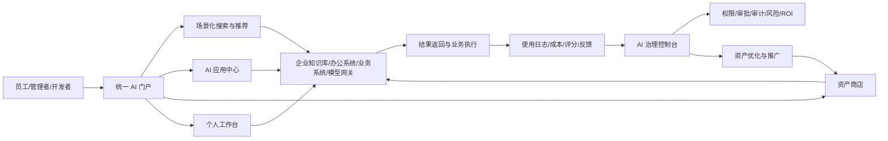
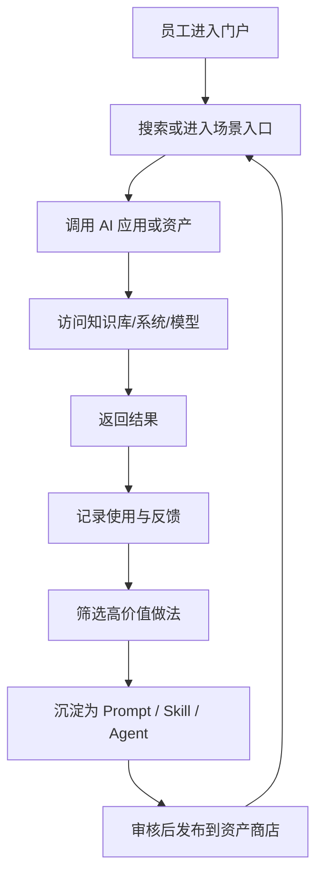
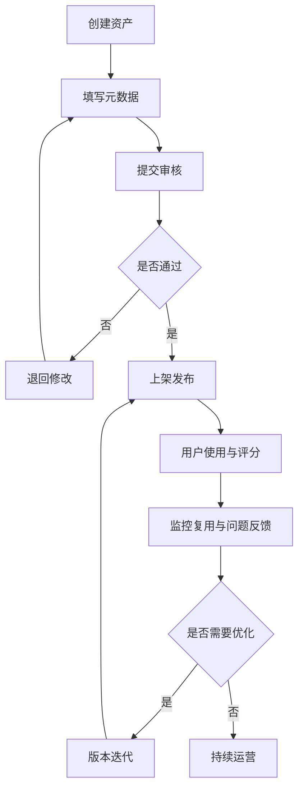
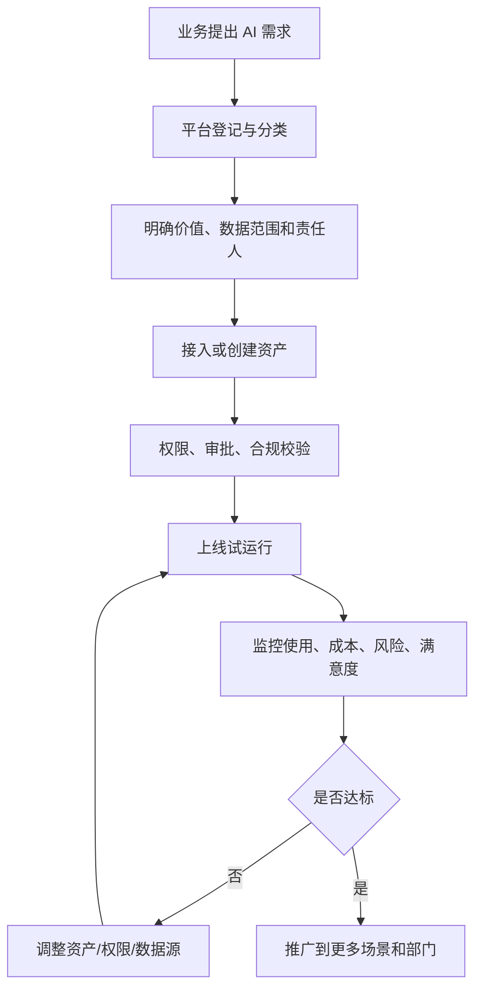

# 企业AI应用门户_业务场景版PRD

> 业务部门：信息技术部
> 服务范围：全公司各部门、各业务线
> 文档版本：v1.0
> 创建日期：2026-03-11
> 关联文档：
> - [企业AI门户.png](../企业AI门户.png)
> - [企业AI应用门户_需求文档.md](../企业AI应用门户_需求文档.md)
> - [企业AI应用门户_MVP收敛清单与部门场景矩阵.md](./archive/企业AI应用门户_MVP收敛清单与部门场景矩阵.md)

---

## 1. 产品定位

企业 AI 应用门户是企业内部统一的 AI 能力入口、资产沉淀平台和治理控制中台。

它不是单纯的 AI 工具导航页，也不是单一对话机器人，而是围绕四个核心目标建设：

1. 统一入口，消除工具孤岛。
2. 沉淀资产，形成企业可复用知识与能力。
3. 管理透明，让使用、成本、风险和价值可见。
4. 业务赋能，让非技术人员也能在受控前提下使用和复用 AI 能力。

---

## 2. 项目背景

随着企业内部 AI 工具逐步增多，各部门开始尝试大模型对话、Agent、Prompt 模板、自动化流程等能力，但实际使用中存在以下问题：

- AI 工具分散在不同入口，员工难以快速找到合适能力。
- 优秀的 Prompt、Skill 和 Agent 只停留在个人或小团队层面，无法形成组织级资产。
- 管理层无法清楚掌握 AI 的实际使用情况、成本消耗和业务价值。
- 业务人员有使用 AI 的需求，但缺少低门槛、标准化、可治理的使用方式。

因此，需要建设一个面向企业内部的统一 AI 门户，以便在“入口统一、资产沉淀、治理可控、业务推广”之间形成闭环。

---

## 3. 目标与成功标准

### 3.1 业务目标

1. 让员工通过一个入口找到并使用合适的 AI 能力。
2. 让高价值 Prompt、Skill、Agent 沉淀为企业资产。
3. 让管理层能够基于使用、成本、复用和效果做决策。
4. 让业务场景从少量试点走向跨部门复制。

### 3.2 成功标准

#### 平台使用

- 首批试点部门能够稳定使用门户。
- 员工能够通过搜索、推荐或场景入口快速找到 AI 能力。
- 门户成为企业内部 AI 能力的主入口之一。

#### 资产沉淀

- 第一阶段形成首批可复用 Prompt / Skill / Agent 资产。
- 不同部门开始复用同一批资产。
- 资产具备审核、版本、可见性和责任人信息。

#### 治理透明

- 管理层可查看使用趋势、Token 成本、资产复用率。
- 关键操作可审计、可追溯。
- 重点场景具备满意度或价值反馈依据。

---

## 4. 目标用户

| 用户角色 | 核心诉求 | 平台价值 |
|----------|----------|----------|
| 普通员工 | 快速找到好用的 AI 应用或模板 | 提升效率，减少查找和切换成本 |
| 业务专家 | 把经验沉淀为可复用资产 | 放大经验价值，减少重复答疑 |
| 部门管理员 | 管理部门内应用、资产和权限 | 推动本部门场景落地 |
| IT / 平台团队 | 统一接入、统一治理、统一运维 | 控制复杂度和安全风险 |
| 管理层 | 看清 AI 使用、成本和 ROI | 支持预算、治理和推广决策 |

---

## 5. 核心业务场景

### 5.1 通用场景

1. 制度与知识问答
2. 文档摘要与提炼
3. 会议纪要生成
4. 报告初稿生成
5. 翻译与润色

### 5.2 部门场景

| 部门 | 场景 | 资产形态 |
|------|------|----------|
| IT | 知识检索、故障协查、工单摘要 | Agent / Skill |
| HR | 制度问答、JD 生成、面试纪要 | Prompt / Agent |
| 综合/行政 | 通知草拟、会议纪要、制度查询 | Prompt / Skill |
| 采购 | 需求整理、供应商比对、询价总结 | Prompt / Workflow |
| 财务 | 报销规则问答、报表说明、采购分析 | Skill / Agent |
| 销售 | 资料检索、拜访纪要、方案润色 | Prompt / Skill |
| 各业务部门自研工具 | 部门内开发的 AI 小工具、Python 程序、桌面脚本分发 | ToolApp / Script / Agent |

### 5.3 MVP 推荐首批场景

- IT 知识检索与工单辅助
- HR 制度问答
- 文档摘要与会议纪要
- 报告初稿生成
- 综合/采购材料整理

### 5.4 新增场景：部门 AI 小工具上架与分发

- 各部门可将本部门基于 AI 开发的小工具统一上架到 AI 门户。
- 小工具形态可包括 Python 程序、脚本包、桌面工具、内部可执行程序或封装后的 Agent 工具。
- 管理员可配置“谁可见、谁可下载、谁可管理”，支持全员、指定部门、指定个人三级控制。
- 工具需具备版本、责任人、使用说明、下载记录、审核状态和下线机制。

---

## 6. 产品目标形态

### 目标形态说明

前台面向员工解决“找得到、用得上、可复用”；后台面向管理员解决“看得清、管得住、能推广”。

---

## 7. 产品功能需求

### 7.1 统一 AI 应用门户

#### 目标

打造企业 AI 能力单一入口，减少员工在多个系统和工具间切换。

#### 功能需求

| 功能项 | 说明 | 优先级 |
|--------|------|--------|
| 统一登录入口 | 集成企业 SSO，登录后进入统一门户 | P0 |
| 门户首页 | 展示场景推荐、常用应用、公告和最近使用 | P0 |
| 全局搜索 | 支持搜索应用、资产、场景、标签 | P0 |
| AI 应用目录 | 展示已接入应用，支持分类筛选 | P0 |
| 部门工具专区 | 展示各部门上架的 AI 小工具和脚本包 | P0 |
| 个人工作台 | 最近使用、收藏、我的资产 | P1 |
| 通知中心 | 审批结果、系统公告、版本变更提醒 | P2 |

#### 用户故事

- 作为企业员工，我希望用一个入口找到所有可用 AI 能力，以减少切换成本。
- 作为新员工，我希望看到推荐场景和常用能力，以便快速上手。

### 7.2 应用商店化资产管理

#### 目标

将 Prompt、Skill、Agent、Workflow、ToolApp 沉淀为企业资产，支持发布、复用、审核和治理。

#### 功能需求

| 功能项 | 说明 | 优先级 |
|--------|------|--------|
| 资产分类管理 | 按 Prompt / Skill / Agent / Workflow / ToolApp 分类 | P0 |
| 资产上架发布 | 用户提交资产，经审核后发布 | P0 |
| 资产元数据 | 描述、标签、适用部门、适用场景、维护人、数据等级 | P0 |
| 资产搜索与筛选 | 关键词、标签、部门、场景、热度、评分等维度筛选 | P0 |
| 资产详情页 | 展示说明、版本、评分、使用量、责任人 | P0 |
| 工具包管理 | 支持上传脚本包、安装包、可执行文件和依赖说明 | P0 |
| 下载与交付管理 | 管理下载地址、文件版本、文件指纹和安装指引 | P0 |
| 版本管理 | 支持版本迭代和回滚 | P1 |
| 收藏与引用 | 用户可收藏并在场景中复用资产 | P1 |
| 评分与评论 | 促进资产优胜劣汰 | P2 |

#### 用户故事

- 作为业务专家，我希望把高质量 Prompt 或 Agent 发布到商店，让其他团队复用。
- 作为普通员工，我希望用搜索和推荐快速找到经过验证的资产。

### 7.3 AI 治理控制台

#### 目标

将原有“全链路数据看板”升级为“AI 治理控制台”，覆盖使用、成本、风险、审批、审计和价值评估。

#### 功能需求

| 功能项 | 说明 | 优先级 |
|--------|------|--------|
| 使用概览 | 展示活跃用户、调用量、资产量、试点部门覆盖 | P0 |
| Token 成本统计 | 按部门、应用、用户统计成本消耗 | P0 |
| 资产复用分析 | 展示哪些资产被高频复用 | P0 |
| 审批与审计 | 查看资产上架、权限申请、关键操作日志 | P0 |
| 工具分发分析 | 查看各部门工具的可见范围、下载量、部门覆盖和下线状态 | P1 |
| 风险视图 | 关注异常调用、异常消耗、敏感资产访问 | P1 |
| ROI 与效果视图 | 展示重点场景提效、满意度、价值反馈 | P1 |
| 自定义报表 | 支持按部门、场景导出分析结果 | P2 |

#### 用户故事

- 作为管理者，我希望看到 AI 使用和成本分布，以便做预算和治理决策。
- 作为平台管理员，我希望能追溯关键操作和高风险行为。

### 7.4 企业级权限控制

#### 目标

基于组织、角色和资源归属实现统一鉴权，保障数据安全和权限边界。

#### 功能需求

| 功能项 | 说明 | 优先级 |
|--------|------|--------|
| 统一身份认证 | 对接企业 SSO / LDAP / AD | P0 |
| 角色权限控制 | 管理员、部门管理员、开发者、普通用户等 | P0 |
| 组织权限控制 | 支持集团/公司/部门/团队等层级 | P0 |
| 数据范围控制 | 根据部门、项目、资源归属控制数据可见范围 | P0 |
| 资产可见性控制 | 私有、部门共享、全公司公开 | P0 |
| 工具可见性控制 | 支持全员、指定部门、指定个人可见 | P0 |
| 工具下载权限控制 | 支持谁可下载、谁可安装、谁可管理 | P0 |
| 工具操作权限控制 | 支持下载、启停、下线、重新发布等动作隔离 | P1 |
| 审批流 | 资产上架、权限申请等需审批 | P1 |
| 审计日志 | 记录关键操作 | P1 |

### 7.5 集成接入能力

#### 目标

让门户真正对接企业环境，而不是停留在链接聚合层。

#### 功能需求

| 功能项 | 说明 | 优先级 |
|--------|------|--------|
| 应用接入标准 | 支持外链、嵌入、API 代理、统一模型网关接入 | P0 |
| 知识源接入 | 接入文档库、知识库、FAQ 等 | P0 |
| 办公系统接入 | 连接会议纪要、办公文档、通知系统等 | P1 |
| 业务系统接入 | 接入 ITSM、HR、采购、CRM 等核心系统 | P1 |
| 模型网关接入 | 统一接入不同大模型能力 | P0 |
| 工具包托管接入 | 支持 Python 脚本、压缩包、桌面程序等内部工具托管与下载 | P1 |

---

## 8. 关键流程

### 8.1 员工使用到资产沉淀流程

### 8.2 资产生命周期流程

### 8.3 治理控制流程

---

## 9. MVP 范围

MVP 范围以 [企业AI应用门户_MVP收敛清单与部门场景矩阵.md](./archive/企业AI应用门户_MVP收敛清单与部门场景矩阵.md) 为准，核心包括：

- 统一登录 + 门户首页 + 应用目录 + 全局搜索
- Prompt / Skill / Agent 三类基础资产商店
- 部门 AI 小工具上架、下载和权限控制（先支持脚本包/安装包类）
- 审批、权限、审计、部门隔离
- 使用趋势、Token 成本、资产复用基础看板
- 接入 2 到 3 个核心知识源或业务系统
- 首批上线 IT、HR、综合/采购等高频场景

---

## 10. 非功能需求

### 10.1 性能

- 首屏加载时间：2 秒以内
- 核心接口 P99：500ms 以内
- 并发能力：支持 1000 并发用户
- 可用性：99.9%

### 10.2 安全

- 全站 HTTPS
- 敏感数据加密存储
- 统一鉴权与访问控制
- 敏感信息脱敏展示
- 审计日志可追溯

### 10.3 可扩展性

- 支持新应用按标准接入
- 支持新资产类型扩展
- 支持多模型统一接入
- 支持后续演进至轻量编排能力

---

## 11. 验收标准

### 11.1 功能验收

- 所有 P0 功能可用并通过测试。
- 员工可通过统一入口完成核心场景使用。
- 管理员可完成资产审核、权限控制和审计查询。

### 11.2 业务验收

- 至少 2 到 3 个部门完成试点。
- 至少形成一批可复用资产。
- 至少能输出使用、成本、复用三类核心分析结果。

### 11.3 管理验收

- 审批流和审计日志生效。
- 高敏资产和部门边界可控。
- 管理层可获取阶段性运营和价值汇报材料。

---

## 12. 风险与应对

| 风险 | 影响 | 应对措施 |
|------|------|----------|
| 工具接入复杂度高 | 门户落地缓慢 | 先定义接入标准，优先接入少量核心系统 |
| 数据安全与合规要求高 | 推广受阻 | 第一阶段优先低风险场景，完善审批与审计 |
| 用户迁移阻力 | 使用率不足 | 以高频场景切入，结合推荐与试点推广 |
| Token 成本上升 | 预算压力 | 建立成本看板、告警和部门配额机制 |
| 资产质量参差不齐 | 复用率低 | 引入审核、评分、版本和责任人机制 |

---

## 13. 结论

本 PRD 将企业 AI 应用门户定义为一个“统一入口 + 资产沉淀 + 治理控制 + 业务推广”的企业级平台。第一阶段不追求大而全，而是优先通过少量高频场景、基础资产商店和基础治理能力建立平台闭环，并为后续扩展到更多部门和更复杂场景打下基础。

