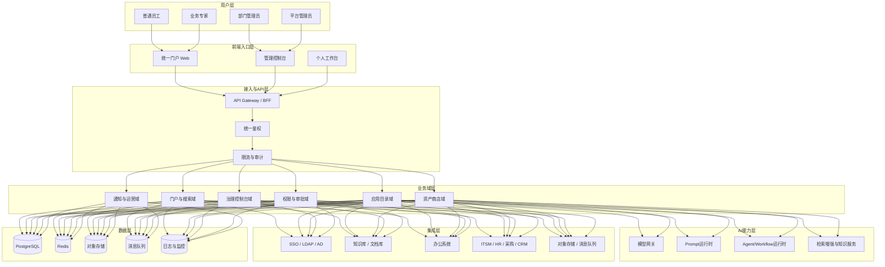
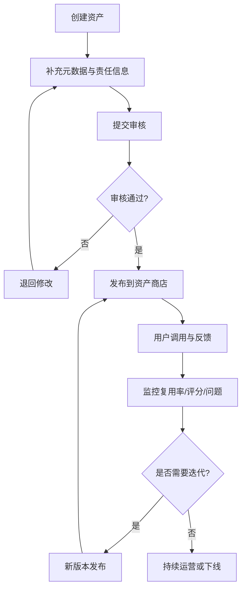
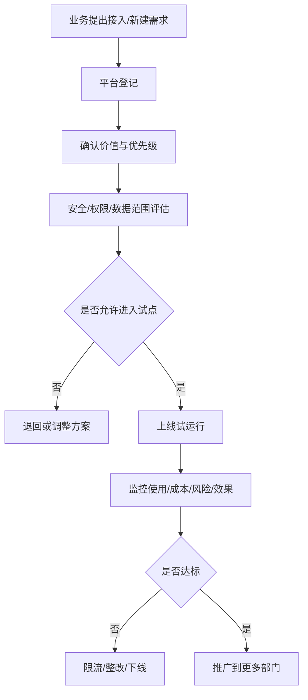
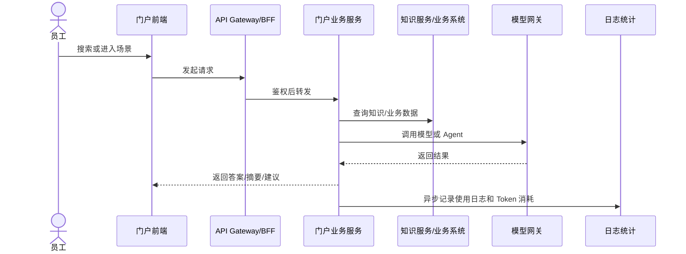
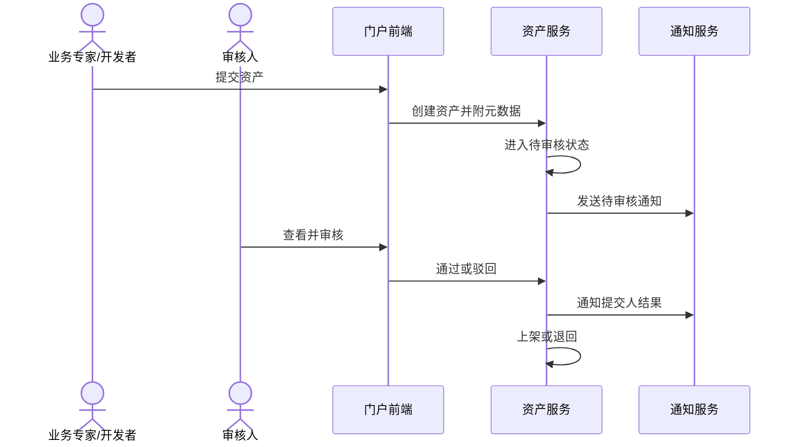
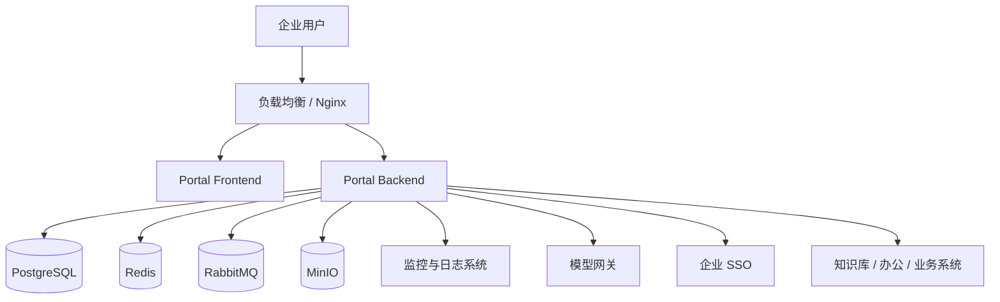

# 企业AI应用门户_企业落地架构方案

> 文档版本：v1.0
> 创建日期：2026-03-11
> 关联文档：
> - [企业AI门户.png](../企业AI门户.png)
> - [企业AI应用门户_业务场景版PRD.md](./企业AI应用门户_业务场景版PRD.md)
> - [企业AI应用门户_MVP收敛清单与部门场景矩阵.md](./archive/企业AI应用门户_MVP收敛清单与部门场景矩阵.md)
> - [企业AI应用门户_实现方案.md](../企业AI应用门户_实现方案.md)

---

## 1. 架构目标

本方案的目标不是设计一套“理想化的大平台”，而是设计一套能在企业真实环境中逐步落地、可接入、可治理、可扩展的架构。

重点解决五类问题：

1. 如何把分散的 AI 应用与能力统一接入门户。
2. 如何把 Prompt、Skill、Agent 沉淀为统一资产模型。
3. 如何在第一期就做好权限、审批、审计、成本和风险控制。
4. 如何用尽量低的复杂度支撑 MVP 快速上线。
5. 如何为后续多部门、多系统、多模型扩展预留空间。

---

## 2. 架构设计原则

### 2.1 业务驱动

架构以业务场景为牵引，而不是以技术栈堆叠为导向。优先支持高频、低风险、可复用场景落地。

### 2.2 先收口，再扩展

先统一入口、接入规范、资产模型和治理控制，再逐步扩展系统接入和复杂编排能力。

### 2.3 单体模块化优先

第一阶段采用“单体模块化 + 清晰边界”的方式，降低企业内部部署、运维、权限管理和协作成本。待规模增长后再拆分微服务。

### 2.4 治理内建

权限、审批、审计、成本、风险和可观测性从第一期内建，而不是平台成型后再补。

### 2.5 接入标准化

所有 AI 应用和资产都必须遵循统一接入标准、统一元数据标准和统一治理规则。

---

## 3. 推荐总体架构

### 架构说明

- 前台解决统一访问和使用体验。
- 中台业务域承载门户、资产、治理和权限逻辑。
- AI 能力层承载模型调用、Prompt 执行、Agent/Workflow 运行和知识检索。
- 集成层负责和企业现有环境打通。
- 数据层承载业务数据、缓存、日志、消息和监控。

---

## 4. 为什么采用单体模块化架构

### 4.1 原因

企业第一阶段最常见的问题不是吞吐不够，而是：

- 业务边界还在变化。
- 系统接入模式还在摸索。
- 权限模型和治理策略需要反复调整。
- 团队人力通常不足以同时维护多个微服务。

因此，第一阶段更适合：

- 一个前端项目
- 一个后端主服务
- 按领域模块化拆分代码与数据库设计
- 对外暴露统一 API

### 4.2 后续拆分条件

满足以下任一条件时，可考虑拆分服务：

- 治理控制台和门户流量/负载差异明显
- 资产运行时与管理后台耦合过深
- 集成连接器数量快速增加
- Agent/Workflow 运行负载显著增长

---

## 5. 业务域划分

| 业务域 | 主要职责 | MVP 是否纳入 |
|--------|----------|--------------|
| 门户与搜索域 | 首页、场景推荐、全局搜索、个人入口 | 是 |
| 应用目录域 | 应用元数据、应用分类、接入方式管理 | 是 |
| 资产商店域 | Prompt / Skill / Agent 资产发布、搜索、版本、收藏 | 是 |
| 治理控制台域 | 使用分析、Token 成本、资产复用、风险与告警 | 是 |
| 权限与审批域 | SSO、角色、组织、审批流、审计日志 | 是 |
| 集成连接域 | 企业知识库、业务系统、第三方 AI 应用接入 | 是 |
| 通知与运营域 | 公告、审批通知、资产运营、推广管理 | 部分 |
| Builder 编排域 | 轻量配置、模板化构建、工作流编排 | MVP 预留 |

---

## 6. 应用接入标准

平台能否真正落地，关键在于先定义“接入模式”，而不是先追求全部自己重做。

### 6.1 四类接入模式

| 模式 | 说明 | 适用场景 | MVP 是否支持 |
|------|------|----------|--------------|
| 外链接入 | 门户展示应用信息，点击跳转原系统 | 已有成熟 AI 工具 | 是 |
| 嵌入接入 | 通过 iframe 或嵌入页接入应用 | 轻量集成、快速收口入口 | 视安全策略 |
| API 代理接入 | 门户统一调用后端能力，再返回结果 | 内部 AI 应用、Prompt 能力 | 是 |
| 原生接入 | 门户自身承载应用逻辑和资产逻辑 | 资产商店、搜索、治理控制台 | 是 |

### 6.2 接入标准元数据

所有接入应用都应至少具备以下字段：

- 应用名称
- 应用类型
- 所属部门
- 接入模式
- 权限范围
- 数据等级
- 责任人
- 维护人
- 上线状态
- 审核状态
- 使用统计口径

---

## 7. 资产模型设计

### 7.1 资产类型

| 资产类型 | 适用对象 | 说明 |
|----------|----------|------|
| Prompt | 普通用户、业务专家 | 可直接复用的提示词模板 |
| Skill | 业务专家、平台团队 | 封装单一任务能力 |
| Agent | 部门团队、平台团队 | 面向完整任务的智能体方案 |
| Workflow | 后续扩展 | 多步骤场景流程 |

### 7.2 资产必备元数据

- 名称
- 描述
- 类型
- 标签
- 适用部门
- 适用场景
- 数据等级
- 可见范围
- 责任人
- 维护人
- 版本号
- 审核状态
- 上架状态

### 7.3 资产生命周期

---

## 8. 权限与治理架构

### 8.1 权限模型

推荐采用 RBAC + 组织范围 + 资源归属的组合模式。

| 控制维度 | 说明 |
|----------|------|
| 角色 | 超级管理员、部门管理员、开发者、普通用户 |
| 组织 | 公司、部门、团队层级范围 |
| 资源归属 | 某应用、某资产、某场景的责任人和维护人 |
| 数据范围 | 哪些知识源、哪些部门数据、哪些资产可访问 |

### 8.2 治理控制点

- 应用准入审核
- 资产发布审批
- 敏感场景权限申请
- Token 成本监控
- 异常调用告警
- 审计日志追踪
- 下线与失效管理

### 8.3 治理流程

---

## 9. 数据与存储架构

### 9.1 推荐技术组合

| 层级 | 推荐技术 | 说明 |
|------|----------|------|
| 前端 | Vue 3 + TypeScript + Vite + Ant Design Vue | 与现有团队能力匹配 |
| 后端 | Go + Gin | 轻量、高性能、易部署 |
| 主数据库 | PostgreSQL 15 | 结构化数据主库 |
| 向量检索 | pgvector（优先） | MVP 阶段减少额外组件 |
| 缓存 | Redis | 会话、热点数据、排行榜 |
| 消息队列 | RabbitMQ | 异步日志、通知、统计 |
| 对象存储 | MinIO | 文档、封面、导入导出文件 |
| 监控 | Prometheus + Grafana + Loki | 指标、日志、可观测性 |

### 9.2 数据分层

| 数据类型 | 存储建议 |
|----------|----------|
| 用户、组织、角色、权限 | PostgreSQL |
| 应用与资产元数据 | PostgreSQL |
| 审批与审计日志 | PostgreSQL + 对象归档 |
| 使用日志与 Token 消耗 | PostgreSQL + 异步聚合 |
| 文档与附件 | MinIO |
| 热点缓存与会话 | Redis |
| 知识向量索引 | PostgreSQL + pgvector |

### 9.3 数据设计原则

- 业务主数据统一进入 PostgreSQL。
- MVP 阶段尽量不引入过多新中间件。
- 检索增强能力优先采用 pgvector，待规模增长后再考虑独立向量库。
- 使用日志与统计计算异步化，避免影响主链路响应。

---

## 10. AI 能力层设计

### 10.1 模型网关

统一负责：

- 多模型接入
- 模型路由与降级
- Token 统计
- 成本核算
- 超时与重试控制

### 10.2 Prompt 运行时

统一负责：

- Prompt 模板参数化
- Prompt 版本管理
- 调用记录
- 输出结果回溯

### 10.3 Agent / Workflow 运行时

第一阶段建议支持：

- 单 Agent 调用
- 轻量流程串联
- 外部工具调用封装

第一阶段不建议支持：

- 高复杂度自治多 Agent 协同
- 无边界开放工具执行

### 10.4 检索增强与知识服务

第一阶段建议支持：

- 企业制度文档检索
- FAQ 问答
- 部门知识库检索
- 指定知识范围内的问答和摘要

---

## 11. 关键链路设计

### 11.1 员工调用 AI 能力主链路

### 11.2 资产发布审核链路

---

## 12. 部署架构建议

### 12.1 环境规划

建议至少区分：

- 开发环境
- 测试/UAT 环境
- 生产环境

### 12.2 生产部署建议

### 12.3 企业落地建议

- 优先部署在企业内网或受控网络区。
- 外部模型调用统一走模型网关和审计出口。
- 所有配置、密钥和连接信息纳入统一配置中心或密钥管理机制。
- 灰度发布时优先按部门和角色放量。

---

## 13. 分阶段实施路径

### 第一阶段：MVP（4~6 周）

- 完成统一登录、门户首页、应用目录、全局搜索
- 完成 Prompt / Skill / Agent 基础资产商店
- 完成权限、审批、审计、基础治理看板
- 接入 2 到 3 个核心知识源或业务系统
- 在 IT、HR、综合/采购部门启动试点

### 第二阶段：扩展与优化（4~6 周）

- 增强部门场景模板
- 增加评分、评论、通知中心
- 优化治理看板，补充 ROI 与风险视角
- 接入更多部门知识和业务系统

### 第三阶段：能力升级（6~10 周）

- 增加 Workflow 资产类型
- 引入轻量构建和参数化配置能力
- 深化跨系统协同和自动化能力
- 视规模情况拆分运行时和治理服务

---

## 14. 风险与架构应对

| 风险 | 架构影响 | 应对方案 |
|------|----------|----------|
| 系统接入复杂度高 | 上线慢、交付拖延 | 标准化接入模式，先少量系统接入 |
| 数据安全顾虑 | 推广受阻 | 内建权限、审批、审计和敏感数据控制 |
| 模型能力不稳定 | 用户体验波动 | 模型网关支持降级、超时和多模型切换 |
| 使用日志量增长 | 主链路性能受影响 | 异步日志与聚合计算 |
| 资产质量不稳定 | 复用效果差 | 审核、版本、责任人、评分与下线机制 |
| 架构过度设计 | 上线周期拉长 | 第一阶段坚持单体模块化 |

---

## 15. 结论

本架构方案的核心，不是做一个技术上最复杂的平台，而是做一个最适合企业第一阶段落地的架构：

- 前端统一入口
- 后端模块化收口
- 接入标准明确
- 资产模型统一
- 治理控制内建
- 技术复杂度受控

这样可以在保证企业安全、治理和可扩展性的前提下，尽快把平台真正落地到具体部门和具体场景中。

