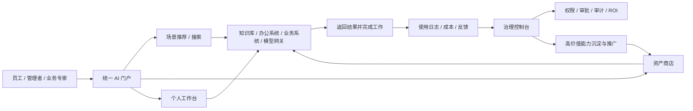

# 企业AI应用门户_综合阅读版

> 目的：将分散在多个补充文档中的核心内容合并成一份总览材料，作为当前阶段的统一阅读入口。
> 建议搭配阅读：
> - [企业AI门户.png](../企业AI门户.png)
> - [企业AI应用门户_业务场景版PRD.md](./企业AI应用门户_业务场景版PRD.md)
> - [企业AI应用门户_企业落地架构方案.md](./企业AI应用门户_企业落地架构方案.md)

---

## 1. 先说结论

这个项目当前最合理的理解，不是单纯做一个“AI 应用列表页”，而是要建设一个企业内部统一的 AI 能力入口，并逐步形成资产沉淀、治理控制和部门场景推广能力。

如果只保留一句话，可以概括为：

**以统一入口承接企业内部 AI 需求，以资产商店沉淀优秀能力，以治理控制台实现安全、成本和效果可见。**

---

## 2. 这个项目到底在解决什么问题

根据原始原型图和后续分析，当前要解决的核心问题有四类：

1. AI 工具和能力分散，入口不统一。
2. 优秀 Prompt、Skill、Agent 等经验无法沉淀成企业资产。
3. 管理层看不到使用情况、成本消耗和实际价值。
4. 业务人员有需求，但缺少低门槛、可复用、可治理的 AI 使用方式。

这四类问题分别对应原型图中的四个主轴：

- 统一入口
- 资产沉淀
- 管理透明
- 业务赋能

---

## 3. 当前收敛后的产品定位

项目定位已经从“功能清单式门户”收敛为三层结构：

### 第一层：统一入口

员工通过企业门户进入，通过搜索、场景推荐、最近使用等方式找到 AI 能力。

### 第二层：资产沉淀

把高价值 Prompt、Skill、Agent 沉淀为可审核、可搜索、可复用、可版本管理的企业资产。

### 第三层：治理控制

通过权限、审批、审计、使用分析、成本看板和复用率分析，实现企业级治理和推广。

---

## 4. 为什么不能只做“应用聚合”

经过外部案例对标后，结论很明确：

- 全球成熟产品都不是只做应用导航。
- 真正有价值的是“统一入口 + Agent/资产商店 + 治理控制台”。
- 如果没有资产沉淀和治理控制，平台会很快退化为入口集合页。
- 如果没有部门场景设计，平台会缺少真正可推广的业务价值。

也就是说，这个项目的关键不是展示多少工具，而是让员工真正通过一个入口完成工作、沉淀能力并形成治理闭环。

---

## 5. 外部案例给我们的启发

这部分内容原本分散在外部案例对标和流程图文档中，这里合并成简版结论。

### Microsoft / EY 类案例的启发

重点不在“工具数量”，而在“员工从统一入口进入，再通过 Agent 完成任务，并把优秀做法沉淀为企业资产”。

### Google / Wells Fargo 类案例的启发

重点不在“聊天能力”，而在“通过统一搜索和 Agent 连接多个内部系统，把信息整合后给出答案和建议”。

### ServiceNow 类案例的启发

重点不在“看板展示”，而在“把看板升级成治理控制台，覆盖权限、审批、风险、成本和 ROI”。

### Atlassian Rovo 类案例的启发

重点不在“页面模块划分”，而在“搜索、对话、构建、Agent 使用入口统一化”。

---

## 6. 当前最重要的收敛结果

### 6.1 MVP 不做大而全平台

当前建议的 MVP 核心是：

- 统一登录
- 门户首页
- 场景化搜索
- Prompt / Skill / Agent 基础资产商店
- 权限、审批、审计、部门隔离
- 使用趋势、Token 成本、资产复用基础看板
- 接入 2 到 3 个核心知识源或业务系统

### 6.2 MVP 建议首批试点部门

建议优先：

1. 信息技术部
2. 人力资源部
3. 综合/行政 或 采购

原因是：

- 这些部门高频场景明显。
- 试点价值直观，容易形成示范。
- 数据边界相对比法务、财务更可控。

### 6.3 MVP 建议首批场景

- 制度问答
- 文档摘要
- 会议纪要生成
- 工单摘要/知识检索
- 报告初稿生成
- 综合/采购材料整理

---

## 7. 当前最建议采用的整体逻辑

### 图的意思

平台前台负责“找到和使用”，平台后台负责“沉淀和治理”，两者通过数据闭环连接起来。

---

## 8. 目前已经形成的正式文档体系

如果只看正式文档，现在主要有三份：

1. [企业AI应用门户_MVP收敛清单与部门场景矩阵.md](./archive/企业AI应用门户_MVP收敛清单与部门场景矩阵.md)
2. [企业AI应用门户_业务场景版PRD.md](./企业AI应用门户_业务场景版PRD.md)
3. [企业AI应用门户_企业落地架构方案.md](./企业AI应用门户_企业落地架构方案.md)

它们分别回答：

- 第一阶段做什么
- 产品怎么定义
- 技术怎么落地

---

## 9. 现在到底该从哪个文档开始看

推荐顺序如下：

1. [企业AI门户.png](../企业AI门户.png)
2. [企业AI应用门户_综合阅读版.md](./企业AI应用门户_综合阅读版.md)
3. [企业AI应用门户_业务场景版PRD.md](./企业AI应用门户_业务场景版PRD.md)
4. [企业AI应用门户_企业落地架构方案.md](./企业AI应用门户_企业落地架构方案.md)
5. [企业AI应用门户_MVP收敛清单与部门场景矩阵.md](./archive/企业AI应用门户_MVP收敛清单与部门场景矩阵.md)

如果只是为了快速进入状态，看前 3 份就够了。

---

## 10. 哪些文档现在可以视为“附录”

以下文档建议保留，但不作为起始阅读入口：

- [企业AI应用门户_外部案例对标.md](./archive/企业AI应用门户_外部案例对标.md)
- [企业AI应用门户_参考案例流程图.md](./archive/企业AI应用门户_参考案例流程图.md)
- [企业AI应用门户_业务场景版PRD_草案.md](./archive/企业AI应用门户_业务场景版PRD_草案.md)
- [企业AI应用门户_进展.md](../GPT_doc/企业AI应用门户_进展.md)

原因是：

- 这些文档更多承担过程分析、汇报补充或历史草稿作用。
- 当前已经有更适合日常阅读和推进工作的正式文档。

---

## 11. 最后建议

从现在开始，建议把文档体系理解成两层：

### 主线文档

- 原始方向：原型图
- 正式需求：业务场景版 PRD
- 正式落地：企业落地架构方案
- 当前总览：综合阅读版

### 附录文档

- 对标材料
- 流程图材料
- 过程记录
- 草稿材料

这样你以后就不会再面临“该从哪个文档开始看”的问题了。

